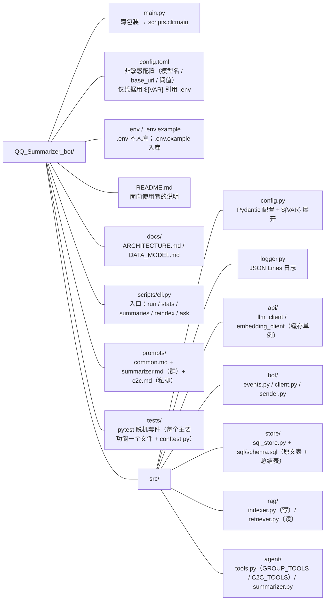
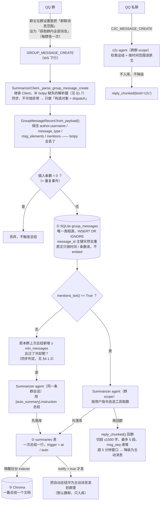

# CLAUDE.md — QQ Summarizer Bot

QQ 群消息总结机器人：接入 QQ 官方机器人（群聊能力）接收群消息，用 LangChain 驱动 LLM 做摘要。

本项目是自包含的：不依赖仓库之外的任何文件或目录，也不绑定任何具体的模型厂商或云网关——所有网关都是 OpenAI 兼容端点，模型名与 `base_url` 写在 `config.toml`，`.env` 只放敏感凭据（api key / QQ secret），靠 `${VAR}` 被 `config.toml` 引用。

面向使用者的说明见 [`README.md`](README.md)；架构与数据模型的细节见 [`docs/`](docs/)。

---

## 项目现状

**实现已完成（脱机可验证部分）**：脱机测试套件（pytest **39 项**，`tests/` 按主要功能分文件）全绿。未完成的只剩真机联调（见 §五）。



`data/`（SQLite + Chroma）与 `logs/` 运行时生成，已 gitignore。

常用命令：

```bash
uv sync
uv run qqbot run                         # 启动机器人（长驻，需真实凭据）
uv run qqbot stats                       # 各群消息数 / 总结数 / 已索引 / 待总结
uv run qqbot summaries [--group <id>]    # 列出知识库里的总结（标明被@ / 自动）
uv run qqbot reindex [--reset]           # 重建**总结**的向量索引
uv run qqbot ask "总结最近 50 条" [--all] [--save]
uv run pytest                            # 脱机测试（pytest + pytest-asyncio，全假模型/假 API/真 Chroma+SQLite）
```

- Python `>=3.13`（`.python-version` 锁 3.13），包管理用 `uv`。
- **测试用 pytest（已配置），CI 在 GitHub Actions**：`tests/` 每个主要功能一个文件——`test_events` / `test_store` / `test_sender` / `test_rag` / `test_agent` / `test_client`，共享 fixtures 与假件在 `conftest.py`；`asyncio_mode = "auto"`，dev 依赖走 `[dependency-groups]`。`.github/workflows/ci.yml` 在 push/PR 到 main 时跑 `uv sync && uv run pytest`——全套脱机，不需要任何凭据。仍**无 lint/typecheck 配置**。
- botpy 的日志由 `setup_logger` 统一接管（`bot_log=True, ext_handlers=False`，见 §三.1）。

---

## 依赖

`pyproject.toml` 声明并实际安装的包：

| 包 | 版本 | 说明 |
|:---|:---|:---|
| `langchain` | 1.4.4 | 高层入口（agents / chat_models / tools） |
| `langchain-core` | 1.6.9 | 被 `langchain` 传递引入 |
| `langgraph` | 1.2.14 | 被 `langchain` 传递引入，`create_agent` 返回的就是它 |
| `langchain-protocol` | 0.0.19 | 传递依赖 |
| `langchain-openai` | 1.7.0 | **已装**。`init_chat_model` / `init_embeddings` 的 `provider="openai"` 全靠它 |
| `langchain-chroma` | 1.1.0 | 持久化向量库；拉入较重的 `chromadb` |
| `openai` | 3.26.1 | 官方 OpenAI SDK（被 `langchain-openai` 使用） |
| `qq-botpy` | 1.2.1 | QQ 机器人 SDK（import 名是 `botpy`） |
| `pytest` / `pytest-asyncio` | dev 组 | 脱机套件（`tests/`，`asyncio_mode="auto"`）；CI 只跑它们 |

### ⚠️ 为什么必须装 `langchain-openai`

`langchain` 自身不含任何模型实现，它只在 `langchain/chat_models/base.py` 的表里把 `"openai"` 映射到 `langchain_openai.ChatOpenAI`：

```python
# langchain/chat_models/base.py:93
"openai": ("langchain_openai", "ChatOpenAI", _call),
```

没有这个包，`init_chat_model(...)` / `init_embeddings(provider="openai")` 都会在**运行时** `ImportError`（不是安装时）。

接任何 OpenAI 兼容的第三方网关也走这条路：装 `langchain-openai`，然后传 `base_url=` / `api_key=`，**不要裸用 `openai` 包**——裸用就拿不到 `create_agent` 的工具循环。本项目 `src/api/` 下的两个 client 就是这么做的。

### 依赖设计上的一个取舍

`langchain-core` 自带 `InMemoryVectorStore`，如果日后想减依赖可以退回它；现在用 Chroma 是为了**持久化**（进程重启不丢向量）。

---

## 包内文档情况（已核实）

- **`qq-botpy`**：**没有**独立 `docs/` 目录。唯一的随包文本是 `qq_botpy-1.2.1.dist-info/METADATA` 里内嵌的 README（178 行，rst 格式）。内容偏"频道（guild）"入门示例，**几乎没有群聊（group）内容**。
- **`langchain` / `langchain-core`**：**完全不带文档**——`find` 无任何 `.md/.rst/.ipynb`，只有源码 docstring。

→ 因此**以 `site-packages` 源码为第一事实来源**，源码里的 docstring 相当完整（尤其 `botpy/api.py` 的 `post_group_message`）。本文档下方所有签名均直接摘自本地源码。

---

## 一、QQ 机器人侧（`botpy`）

### 1.1 鉴权

`botpy/robot.py` 的 `Token` 类负责自动取用与刷新 access_token：

- 取 token：`POST https://bots.qq.com/app/getAppAccessToken`，body `{"appId": ..., "clientSecret": ...}`，返回 `access_token` + `expires_in`（秒）。
- 请求头：`Authorization: QQBot <access_token>`、`X-Union-Appid: <app_id>`（见 `botpy/http.py:146`）。
- `check_token()` 在过期时自动刷新，业务代码不用管。**注意 token 用 `appid + secret` 换，不是预生成的固定 token。**

### 1.2 Client 骨架

`intents` 决定订阅哪些事件；事件以 `on_<小写事件名>` 方法暴露（`botpy/client.py:ws_dispatch` 动态 `getattr`，没有注册也不会报错，只是 debug 日志）。

```python
import botpy
from botpy.message import GroupMessage

class MyClient(botpy.Client):
    async def on_ready(self):
        print(f"robot 「{self.robot.name}」 on_ready!")

    async def on_group_at_message_create(self, message: GroupMessage):
        await message.reply(content="收到")

intents = botpy.Intents(public_messages=True)
client = MyClient(intents=intents)
client.run(appid="12345", secret="xxxx")   # 阻塞，必须是最后一行
```

### 1.3 Intents 速查（`botpy/flags.py`）

群聊只需 `public_messages`（bit `1 << 25`），它一次性打开全部公域群 / C2C 事件：

| 事件 | 触发时机 |
|:---|:---|
| `on_group_at_message_create` | **收到群里 @机器人 的消息** |
| `on_c2c_message_create` | 收到单聊消息 |
| `on_group_add_robot` / `on_group_del_robot` | 机器人被拉入 / 移出群 |
| `on_group_msg_reject` / `on_group_msg_receive` | 群主拒绝 / 接受机器人主动消息 |
| `on_friend_add` / `on_friend_del` | 用户添加 / 删除机器人 |
| `on_c2c_msg_reject` / `on_c2c_msg_receive` | 用户拒绝 / 接受主动消息 |

其他常用：`public_guild_messages`（`1 << 30`，频道 @消息）、`guild_messages`（`1 << 9`，**仅私域**）、`direct_message`（`1 << 12`）。
构造器：`Intents.none()` / `Intents.all()` / `Intents.default()`；也可 `intents = botpy.Intents.none(); intents.public_messages = True`。传入非法 flag 名会 `TypeError`。

### 1.4 群消息对象 `GroupMessage`（`botpy/message.py`）

继承 `BaseMessage`，**注意它没有 `channel_id` / `guild_id`，群聊用 `group_openid` 标识**：

| 字段 | 含义 |
|:---|:---|
| `id` | 消息 ID（回复时作为 `msg_id`） |
| `event_id` | 事件 ID（WS 下行 payload 的顶层 `id`，与消息 ID 不同） |
| `content` | 文本内容（@机器人 的部分已被剥离，含前导空格） |
| `group_openid` | 群标识 |
| `author.member_openid` | 发言者标识（**匿名化 openid，非 QQ 号**） |
| `timestamp` | 时间戳 |
| `msg_seq` | 消息序号 |
| `attachments` / `mentions` / `message_reference` | 图片附件 / @列表 / 引用 |

便捷回复：`await message.reply(content=...)`，内部即 `post_group_message(group_openid=..., msg_id=self.id, ...)`（`message.py:260-261`）。

#### ⚠️ `_User` 被嵌套类遮蔽 —— `mentions` 里也没有 `bot` / `username`

`BaseMessage.__slots__`（`message.py:190-201`）里 `msg_seq` **确实存在**（读 `data.get("msg_seq")`），但它是**发送侧**字段；群聊下行 payload 里没有，所以实际恒为 `None`，去重只能靠 `id`。

更隐蔽的是：`BaseMessage.__init__` 里两处都写 `self._User(...)`：

```python
# message.py:206, 216
self.mentions = [self._User(items) for items in data.get("mentions", {})]
```

而 `self._User` 是按 `type(self)` 查的 —— `GroupMessage` 自己定义了一个只读 `member_openid` 的 `_User`（`message.py:253-255`），**遮蔽**了基类的那个（基类的读 `id`/`username`/`bot`/`avatar`）。后果：

| 想拿的 | 用 `GroupMessage` 能拿到吗 |
|:---|:---|
| `msg.author.member_openid` | ✅ |
| `msg.author.username` | ❌（被遮蔽） |
| `msg.mentions[i].bot` | ❌（`mentions` 元素是同一个受限 `_User`） |
| `msg.mentions[i].username` | ❌ |

所以**在 `GROUP_AT_MESSAGE_CREATE` 退路里（只用 botpy 的 `GroupMessage`）无法从 `mentions` 判定 bot**——但那条路上事件本身就是"被 @"的证明，不需要再判。反过来在 `GROUP_MESSAGE_CREATE` 路径上，只有自建事件对象吃原始 `d.mentions` 才拿得到 `bot` 位。

### 1.5 发送群消息 `BotAPI.post_group_message`（`botpy/api.py:1380`）

`POST /v2/groups/{group_openid}/messages`

```python
async def post_group_message(
    self,
    group_openid: str,
    msg_type: int = 0,              # 0 文本 / 1 图文混排 / 2 markdown / 3 ark / 4 embed / 7 富媒体
    content: str = None,
    embed=None, ark=None,
    message_reference=None,
    media=None,
    msg_id: str = None,             # 被动回复填被回复的消息 ID
    msg_seq: int = 1,               # 与 msg_id 联合使用；相同 msg_id+msg_seq 重复发送会失败
    event_id: str = None,
    markdown=None, keyboard=None,
) -> message.Message
```

源码 docstring 里明确的硬约束：

- **被动回复消息有效期为 5 分钟。**
- **发送消息接口要求机器人连接到 websocket gateway 并保持在线**——即 HTTP 单独发消息不可行，必须让 `client.run()` 常驻。这对架构有决定性影响：总结任务不能是一个"离线批处理脚本"。
- 相同 `msg_id` + `msg_seq` 重复发送会失败 → 同一事件要分多条回复时必须自增 `msg_seq`。

富媒体两步走：先 `post_group_file(group_openid, file_type, url, srv_send_msg=False)`（`file_type`：1 图片 / 2 视频 / 3 语音 / 4 文件(暂不开放)）拿到 `Media.file_info`，再作为 `media=` 发出。`srv_send_msg=True` 会直接发出并**占用主动消息频次**。

### 1.6 群聊可用的全部端点（`botpy/api.py` 全量 Route 扫描）

botpy 对群聊 / 单聊只暴露这 4 个端点：

```
POST /v2/groups/{group_openid}/messages      # 发群消息
POST /v2/users/{openid}/messages            # 发单聊消息
POST /v2/groups/{group_openid}/files        # 上传群聊媒体
POST /v2/users/{openid}/files               # 上传单聊媒体
```

其余 Route 全是频道（guild）体系的 `/guilds/...`、`/channels/...`、`/dms/...`。
**`GET /channels/{channel_id}/messages` 是子频道消息查询，群聊用不上。**

> 注意：**群聊没有"拉取历史消息"接口**——官方从未提供，botpy 自然也没有。消息只能靠实时事件累积（详见 §1.7）。

### 1.7 接收群内全部消息（`GROUP_MESSAGE_CREATE`）—— 本项目的命脉

官方事件 `GROUP_MESSAGE_CREATE` 会推送**群内每一条消息，不限于 @机器人**，字段与 `GROUP_AT_MESSAGE_CREATE` 一致。这是"总结整个群"唯一的消息来源。

- 事件名：`GROUP_MESSAGE_CREATE`；intent 同为 `GROUP_AND_C2C_EVENT (1 << 25)`，即 botpy 的 `Intents.public_messages`。
- 文档：<https://bot.q.qq.com/wiki/develop/api-v2/autogen/event/group_message_create.html>
- 下行字段（`d`）：`id` / `author` / `content` / `group_openid` / `timestamp`(RFC3339) / `message_type` / `message_scene` / `attachments` / `mentions` / `ark_data` / `msg_elements`。
- `author` 含 `member_openid`（群聊标识）、`username`（**昵称**）、`member_role`（`member`/`admin`/`owner`）。

#### 🔴 坑一：botpy 1.2.1 不认识这个事件

`grep -r group_message_create botpy/` **零命中**。分发链路是：

```python
# botpy/connection.py:86-88  —— 只把 parse_ 开头的方法注册进 parsers
for attr, func in inspect.getmembers(self):
    if attr.startswith("parse_"):
        self.parsers[attr[6:].lower()] = func

# botpy/gateway.py:93-99  —— 查不到就只打一条 error 日志，事件被丢弃
event = msg["t"].lower()
try:
    func = self._parser[event]
except KeyError:
    _log.error("_parser unknown event %s.", event)
else:
    func(msg)
```

即：intent 订阅对了、服务端也推了，但 botpy 会打一行 `_parser unknown event group_message_create` 然后把事件**扔掉**，`on_group_message_create` 永远不会被回调。

#### 修法：继承 `Client` 并重写 `_bot_login`（不碰 SDK 源码）

三个事实让这个接缝很安全：

1. `ConnectionSession.parser` 与 `ConnectionState.parsers` **是同一个 dict 对象**（`connection.py:39-40`）。
2. `Client._bot_login` 跑在 `_bot_init → _pool_init → bot_connect` **之前**，而 `BotWebSocket` 要到 `bot_connect` 才去取 `_connection.parser`（`gateway.py:45`）。
3. 既然是同一个 dict，即便再晚一点改也能被看到。

```python
import botpy

class SummarizerClient(botpy.Client):
    async def _bot_login(self, token):
        await super()._bot_login(token)
        # 补上 SDK 1.2.1 缺失的解析器（与 state.parsers 同一对象）
        self._connection.parser["group_message_create"] = self._parse_group_message_create

    def _parse_group_message_create(self, payload):
        # payload 是整个 WS 帧：{"id": 事件id, "op": 0, "s": ..., "t": ..., "d": {...}}
        self.ws_dispatch("group_message_create", GroupRecord(self.api, payload.get("d", {})))

    async def on_group_message_create(self, record: "GroupRecord"):
        ...   # 落库 / 摘要
```

要点：

- 解析器签名是 `func(payload)`，且 payload 是**整个 WS 帧**（事件体在 `d` 里），与 `ConnectionState.parse_*` 的形参一致。
- ⚠️ **解析器是同步调用、且不在 try 里**（`gateway.py:94-99` 只把「查表」包了 try）。解析器抛异常会顺着 `ws_connect` 冒出去 → 被 `bot_connect` 捕获 → 触发 `on_error` 与重连。所以解析器里只做「构造对象 + dispatch」，真正的活留给 async handler —— 那条路径被 `Client._run_event` 包着，异常会正常走 `on_error`。
- 更「正统」但更啰嗦的写法：子类化 `ConnectionState` 加一个 `parse_group_message_create` 方法，再子类化 `ConnectionSession` 用你的 state，然后 override `_bot_login` 去构造它（`ConnectionSession.__init__` 里 `ConnectionState(...)` 是写死的）。代价是照抄 `_bot_login` 那 8 行内部实现。**推荐上面的轻量版**：只需 override 一个方法，与 SDK 内部耦合最小。

#### 🔴 坑二：`GroupMessage` 会丢掉摘要最需要的字段

`GroupMessage.__init__` 只读这些键：

```python
self.id / content / timestamp / msg_seq / event_id
self.message_reference / mentions / attachments
self.group_openid
self.author.member_openid      # ← _User 只读这一个字段！
```

因此下列**官方有、但 botpy 丢弃**的字段，直接用 `GroupMessage` 拿不到：

| 丢弃的字段 | 影响 |
|:---|:---|
| `author.username` | **拿不到发言人昵称** —— 摘要里没法写"谁说了什么" |
| `author.member_role` | 无法区分群主/管理员 |
| `message_type` | 无法区分文本/卡片/引用（0/3/101/102/103） |
| `message_scene` | 拿不到 `msg_idx` / `ref_msg_idx`（引用回复要用）|
| `msg_elements` | **引用消息、合并转发（聊天记录）的正文全在这里** |
| `ark_data` | 卡片消息内容 |

**结论**：要做有意义的群消息摘要，不能只用 `GroupMessage`，应自己写一个事件对象直接吃原始 `d`（至少保留 `author.username` + `message_type` + `msg_elements`）。上面补丁里的 `_parse_group_message_create` 就是介入点——把 `GroupMessage` 换成自己的类即可。

#### 🔴 坑三：@ 触发只能靠 `mentions`，不能靠 `content`

在**全量消息模式**下，`GROUP_MESSAGE_CREATE` 的 `content` 是**已剥离 @机器人 前缀的文本**（官方原文"已去除@机器人的前缀"）。也就是说被 @ 的消息和不被 @ 的消息，正文长得一样——**`content` 里没有任何可判定"机器人被叫了"的信息**。

唯一信号是 `d.mentions` 列表：被 @ 时它会含一个 `bot: true` 的元素。

```python
@dataclass(slots=True)
class Mention:
    openid: str | None = None      # 注意：payload 里这个字段叫 `id`，不是 member_openid
    username: str | None = None
    is_bot: bool = False           # 读 `bot` 字段

    @classmethod
    def from_dict(cls, data: dict) -> "Mention":
        return cls(openid=data.get("id") or data.get("member_openid"),
                   username=data.get("username"),
                   is_bot=bool(data.get("bot")))

def mentions_bot(self) -> bool:
    """判定是否被召唤 —— 唯一的触发信号。"""
    return any(m.is_bot for m in self.mentions)
```

⚠️ **不要用 id 比对**：`mention.id` 是 OpenID，不是 appid，没有可比对的目标。只认 `bot` 布尔位。

⚠️ **同一件事可能来两个事件**：开了全量消息后，@ 消息**可能同时**下发 `GROUP_MESSAGE_CREATE` 和 `GROUP_AT_MESSAGE_CREATE`。两条路都要接，但**只处理一次**——用 `INSERT OR IGNORE` 的**实际插入条数**当触发闸门（插入 0 条说明是重复事件，不再触发总结）。

### 1.8 发送侧硬约束（官方文档核实）

| 项 | 限制 |
|:---|:---|
| 被动回复有效期 | **5 分钟**（附 `msg_id` 或 `event_id`） |
| 单条消息最多被动回复 | **5 次**（靠 `msg_seq` 递增区分） |
| `msg_seq` | 默认 1；相同 `msg_id` + `msg_seq` 重复发送**会失败** |
| 不附 `msg_id`/`event_id` | 视为**主动消息**，受频次上限 + 用户在客户端可自行关闭 |
| 主动消息频次（群聊） | 已认证 60 条/分钟(机器人级)、未认证 30 条/分钟；单群 **20 条/分钟** |
| 主动消息单群/天 | **1000 条** |
| 发群消息接口 | 100 QPS |
| 频率超限错误码 | HTTP `429`；`1100100` 消息被限频；`620006` 操作限频 |
| 发送侧 `msg_type` | **仅 0 文本 / 2 markdown / 7 富媒体**（官方消息类型页写"0/2/3/7"但表里未定义 3，自相矛盾——以发送接口页为准） |
| 群消息 | **不支持流式参数** |

#### 🔴 发送侧三个源码级陷阱（已逐条复核 `botpy/`）

**① `post_group_message` 发的是 `locals()` —— 所有参数都会进请求体，包括 null。**

```python
# botpy/api.py:1421
payload = locals()
payload.pop("self", None)
route = Route("POST", "/v2/groups/{group_openid}/messages", group_openid=group_openid)
return await self._http.request(route, json=payload)
```

自己包一层发送函数时，**不要**顺手传一堆 `None`（例如 `markdown=None, keyboard=None, ark=None`）就以为"没传"。要写 `{k: v for k, v in kwargs.items() if v is not None}` 过滤，否则请求体里全是显式 null，服务端行为不可预期。

**② HTTP 层吞掉超时，返回 `None` 而不是抛异常。**

```python
# botpy/http.py:191-195
except asyncio.TimeoutError:
    _log.warning(f"请求超时，请求连接: {route.url}")     # ← 没有 raise，函数就此结束 → 隐式 return None
except ConnectionResetError:
    _log.debug("session connection broken retry")
    await self.request(route, retry_time + 1, **kwargs)  # ← 递归重试
```

所以 **`None` 必须当作发送失败处理**，不能被当成"发成功了只是没返回体"。`src/bot/sender.py` 里每条 chunk 都显式判 `sent is None` 并终止后续分片（否则会对着一个掉线的连接连发 5 条）。

**③ HTTP `429` 映射成 `SequenceNumberError`。**

```python
# botpy/errors.py:50-58
HttpErrorDict = {401: ..., 403: ..., 404: ..., 405: ..., 429: SequenceNumberError, 500: ServerError, 504: ServerError}
```

`SequenceNumberError` 这个名字指的是"**相同 `msg_id` + `msg_seq` 重复发送**"（`errors.py:28`），但 `429` 也会落到它头上。因此**捕获到它时无法区分"msg_seq 撞车"和"被限频"**——两者的正确反应都是"别再重试这一条"，所以不要在里面做自动重试，只记日志并停止当前这条回复的分片。

### 1.9 使用前提（决定能不能跑起来）

- **主体认证分级**：未认证只能加"自己是群主"的群；**个人认证**即可公开使用，进群上限 500；企业认证无明确上限。个人开发者可用群聊。
- **必须由群主在手机 QQ 里逐群授权**：三个开关都在同一个页面 —— **手机 QQ → 该群 → 群设置 → 「群机器人」→ 该机器人 → 机器人设置**：「**机器人可获取的群聊消息范围**」（不开就只有 @消息）、「机器人主动在群聊内发言」（不开就无法主动发言）、撤回成员消息（需机器人是群管理员）。**只能群主操作，每个群各设一次。**
- **全量消息权限：开关在群设置里，不在开放平台**（2026-10-09 真机实测）。`GROUP_MESSAGE_CREATE` 唯一需要的就是上面那个群主开关 —— 实测把「机器人可获取的群聊消息范围」设为「**获取群内全部消息**」之后事件即正常下发，**没有走开放平台的审核申请**。官方事件页只说"当机器人开启了『接收所有消息』功能后…"，**通篇没给 UI 位置**；上面的路径来自第三方文档（AstrBot / MaiBot），实测与该描述一致。平台的「事件订阅」保持与本地 intent 一致即可。（官方 Intents 总表 `payload.html` 只列了 `GROUP_AT_MESSAGE_CREATE`，未列 `GROUP_MESSAGE_CREATE`，以事件详情页为准。）
- **怎么判断权限生效没有**（排查"收不到非 @ 消息"时的第一招）：看库里那一行的三个字段 —— `event_id` 是**裸消息 ID**、`author_name` 有昵称、`raw_json` 非空（整个 WS 帧）= 走全量事件；`event_id` 形如 `GROUP_AT_MESSAGE_CREATE:<事件id>`、`author_name` 为 `NULL`、`raw_json` 为 `{}` = 走 `GroupMessageRecord.from_at_message` 退路（botpy 的 `GroupMessage` 只填了它读的那几个字段）。`qqbot stats` 的「消息数」不涨是最直接的信号。
- 管理员账号可直接测试，新版管理端**无需沙箱**。

### 1.10 基址不一致（注意）

botpy 写死 `api.sgroup.qq.com`（沙箱 `sandbox.api.sgroup.qq.com`），token 端点 `https://bots.qq.com/app/getAppAccessToken`；而当前官方文档给的基址是 `api.bot.qq.com`。**自己写 httpx 补接口时以官方文档为准，但注意与 botpy 自带调用可能不同源。** AccessToken 有效期 7200 秒，botpy 的 `Token.check_token()` 已自动处理刷新。

---

## 二、LangChain 侧（1.4.4）

### 2.1 `create_agent`（`langchain/agents/factory.py:892`）

```python
from langchain.agents import create_agent

agent = create_agent(
    model="<provider>:<model>",    # 或已初始化的 BaseChatModel 实例
    tools=[...],                   # BaseTool / Callable / dict
    system_prompt="...",           # str 或 SystemMessage
    response_format=MyPydantic,    # 结构化输出，结果在 result["structured_response"]
    checkpointer=InMemorySaver(),  # 开启多轮记忆
    state_schema=MyState,          # 扩展 AgentState
    context_schema=MyContext,      # 每轮运行时上下文
)
```

返回值是 LangGraph 的 `CompiledStateGraph`。调用方式（状态更新 payload 是 role/content 字典列表）：

```python
result = await agent.ainvoke(
    {"messages": [{"role": "user", "content": "..."}]},
    config={"configurable": {"thread_id": group_openid}},
)
text = result["messages"][-1].content
```

`ainvoke` 是 LangGraph 标准异步入口（与 botpy 的 asyncio 事件循环天然兼容，**优先用异步版**）。

### 2.2 工具

```python
from langchain.tools import tool

@tool
def search(query: str) -> str:
    """Search for information."""
    return f"Results for: {query}"
```

`langchain.tools` 还导出 `InjectedState` / `InjectedStore` / `InjectedToolCallId` / `ToolRuntime` / `ToolException`，用于工具内访问 agent 状态或存储。

#### 2.2.1 `ToolRuntime` 注入：参数名必须叫 `runtime`

服务端要往工具里塞"当前群"这类 LLM 不该看见的上下文，标准做法是 `ToolRuntime` 按**参数名**注入：

```python
from langchain.tools import ToolRuntime, tool

@tool
async def recent_messages(
    limit: int = 200,
    *,                                        # runtime 必须是关键字参数
    runtime: ToolRuntime[BotContext, dict],   # 名字必须叫 runtime、类型参数不能省
) -> str:
    """取本群最近 limit 条消息。"""
    group_openid = runtime.context.group_openid   # 服务端注入，LLM 碰不到
```

配套 `create_agent(..., context_schema=BotContext)` + 每轮 `ainvoke(..., context=BotContext(group_openid=...))`。不需要 `Annotated` 包装。

#### ⚠️ 类型参数不能省：裸 `ToolRuntime` 会让每次工具调用刷一条 pydantic 告警

`ToolRuntime` 是**泛型 dataclass**，两个 TypeVar **都带默认值**（`tool_node.py:105-106`）：

```python
StateT   = TypeVar("StateT",   default=dict)
ContextT = TypeVar("ContextT", default=None)     # ← 陷阱在这里
```

写成裸 `runtime: ToolRuntime` 时，langchain 给工具建的 args schema 里那个字段就是**未参数化**的 `ToolRuntime`（`langchain_core/utils/pydantic.py` 的 `create_model` 原样保留注解），pydantic 于是**用 TypeVar 默认值**去解析它 → `runtime.context` 的 schema 变成 `None`。

而 `BaseTool._parse_input` 每次调用都要 dump 一遍校验结果：

```python
# langchain_core/tools/base.py:835
result_v2 = input_args.model_validate(tool_input)
result_dict = result_v2.model_dump()      # ← 这里对着 BotContext 报 "Expected `none`"
```

症状是**每次工具调用**都在 stderr 上刷：

```
UserWarning: Pydantic serializer warnings:
  PydanticSerializationUnexpectedValue(Expected `none` - serialized value may not be as expected
    [field_name='context', input_value=BotContext(...), input_type=BotContext])
```

两个容易被它绕进去的点：

- **功能完全正常**。校验那一侧对这两个字段足够宽松，`runtime.context` 拿到的仍是真 `BotContext`（`test_agent_boundary` 的越权断言一直是通过的），所以这是**纯 stderr 噪音**，但长得像缺陷。
- **`_RT` 之类的替身测不出来**。直接调 `tool.coroutine(..., runtime=替身)` 会绕过 `_parse_input`，只有真的走一遍 ToolNode 才会触发。`tests/test_agent.py` 因此把"真实注入路径不产生 pydantic 序列化告警"单独列了一项测试（`test_forged_runtime_stripped_and_no_pydantic_noise`），并静态断言 6 个工具的 `runtime` 注解都带类型参数。

改法就是补上类型参数：`runtime: ToolRuntime[BotContext, dict]`。`StateT` 的默认值本来就是 `dict`，所以 `ToolRuntime[BotContext]` 也不告警；只有 `ContextT` 的默认值 `None` 会踩坑。参数化不影响注入：`_is_injected_arg_type` 认的是 `get_origin(annotation)`，订阅形式照样命中 `_DirectlyInjectedToolArg`。

**为什么 `group_openid` 绝不能做成 LLM 可填的参数**：LLM 可能填错、可能被群消息里的注入文本诱导去读**别的群**——那既是串味也是隐私泄漏。

**这个边界是被工具链强制的，不是靠约定**：

- `langgraph/prebuilt/tool_node.py:1424-1430` 会在执行工具前，**剥掉 LLM 塞进 args 里的、属于注入参数的值**，再用真实上下文覆盖。
- 因此 `tool_call_schema`（`bind_tools` 真正发给模型的那份 schema）**不含** `runtime`；而 `get_input_schema()`（完整 schema）**含** `runtime`。
  写测试断言"LLM 看不见 runtime"时，要断言 `tool_call_schema` 而不是 `get_input_schema`，否则会得到一个假失败。

`tests/test_agent.py` 的 `test_real_toolnode_keeps_search_scoped` 就是干这个的：伪造一个 `runtime: "G_other"` 塞进 tool call，断言工具读到的仍然是注入进来的那个群。

### 2.3 记忆 / 持久化

```python
from langgraph.checkpoint.memory import InMemorySaver
```

- **当前只装了内存版 checkpointer**（`langgraph_checkpoint_sqlite` / `_postgres` 均未安装）。
- `InMemorySaver` 进程重启即丢；若要让摘要跨重启留存，需 `uv add langgraph-checkpoint-sqlite` 后换 `SqliteSaver`（或自己落 SQLite）。
- 用 `thread_id` 隔离会话 —— 本项目用前缀区分两个 scope：`G:<group_openid>`（群）与 `U:<user_openid>`（私聊）。**前缀是必需的**：两个 agent 共用同一个 checkpointer，而 `checkpoint_ns` 都是 `""`，`thread_id` 是唯一的分隔符。
- ⚠️ **`InMemorySaver` 会随 thread 数无限增长**，所以 `src/agent/summarizer.py` 加了 LRU：超过 `MAX_THREADS=128` 时用 `checkpointer.delete_thread(oldest)` 淘汰最久未用的线程（群与私聊共享这一个预算）。LRU 记的 key 必须与 `ainvoke` 用的 `thread_id` 完全一致，否则 `delete_thread` 落空、checkpoint 静默泄漏。
- `create_agent(...)` 的递归上限用 `ainvoke(..., config={"recursion_limit": 25})` 控制（`RECURSION_LIMIT`）。agent 可能"取数 → 看不够 → 再取数"来回几轮，默认上限不一定够，但也不能放开成无限。

### 2.4 消息类型

`langchain.messages` 统一 re-export `langchain_core.messages`：`HumanMessage`、`AIMessage`、`SystemMessage`、`ToolMessage`、`trim_messages`、`UsageMetadata` 等。长群聊内容需裁剪时用 `trim_messages`。

---

## 三、开发要点与坑（本项目特有）

1. **`import botpy` 会污染 root logger**：`botpy/__init__.py:2` → `botpy/logging.py:24` 在**模块顶层**执行 `logging.basicConfig(format=DEFAULT_PRINT_FORMAT)`，于是 import 的瞬间就给 root 挂上一个 **level = NOTSET** 的 stderr `StreamHandler`（`NOTSET` 意味着它会放行一切，包括 `DEBUG`）。本项目 `src/logger.py` 的对策：
   - 把自定义 handler 挂在**真正的 root** logger 上，并在配置时**摘掉** botpy 留下的裸 `StreamHandler`，避免重复输出；
   - root 设 `DEBUG`、**由 console handler 自己带配置的 level**，这样 JSON 文件永远收全量，而控制台只按 `--verbose` / `logging.level` 决定；
   - `_NOISY` 里压低 `aiohttp` / `botpy` / `chromadb` / `httpcore` / `httpx` / `urllib3` / `websockets`。
   - ⚠️ `setup_logger()` 是**一次性**配置，必须在 `main()` 里按 `--verbose` 调用一次；**不要在模块导入时调**，否则 `--verbose` 会变成静默无效（`scripts/cli.py` 因此只在模块级 `logging.getLogger`）。
2. **机器人必须常驻 WS**：`client.run()` 阻塞运行且发消息接口依赖 WS 在线，所以入口应该是单一常驻进程，不要在别处另起脚本发消息。
3. **`client.run()` 必须是最后一行**（源码 docstring 明示）；需要自己掌控协程时改用 `async with Client(...) as c: await c.start(appid, secret)`。
4. **`GroupMessage` 没有 `channel_id`**：不要照抄频道示例里的 `message.channel_id`；群聊一律用 `group_openid`。
5. **openid 已匿名化，但昵称有**：`member_openid` / `group_openid` 不是 QQ 号。昵称 `author.username` **官方事件里是有的，只是被 botpy 的 `GroupMessage` 丢掉了**——必须走 §1.7 的自定义事件对象才能拿到。拿不到昵称就只能写"某成员"。
6. **同一事件回复多条要自增 `msg_seq`**，否则第二条起会失败（相同 `msg_id`+`msg_seq` 重复发送失败）。
7. **被动回复窗口 5 分钟**：LLM 摘要不能太慢，否则错过回复窗口。
8. **`on_error` 可覆写**做全局异常兜底（默认只是 `traceback.print_exc()`）；`botpy.Client(bot_log=..., log_config=..., log_level=...)` 可接管 botpy 自己的日志，需与项目日志统一时在这里配置。
9. **append-only 语义**：agent 的 `messages` 是 append-only，长期运行的群会话要配裁剪或摘要策略，否则上下文无限增长。

---

## 四、架构结论（由上述约束倒推）

因为**官方没有拉取历史消息的接口**，可总结的语料只能靠机器人自己在线接收并落库累积：



由此固定的几条设计约束：

1. **进程必须长期在线**：既是发消息的硬性要求（WS 在线），也是积累语料的唯一途径。**不补历史**是既定取舍 —— 只总结机器人上线后收到的消息。
2. **必须自建消息存储**：官方零历史接口，botpy 也不落库。这是本项目真正的工作量所在（也是唯一需要持久化的东西）。
3. **必须继承 `Client` 补 `GROUP_MESSAGE_CREATE` 解析器 + 自定义事件对象**（见 §1.7），否则要么收不到事件，要么摘要里没有发言人昵称。
4. **摘要在 5 分钟内完成**，否则错过被动回复窗口；长摘要要拆多条并递增 `msg_seq`（最多 5 条），或改用主动消息推送（吃配额）。
5. **语料不能只靠人 @**：`@` 是"用户主动要一份总结"，不是语料生产机制——反馈群里没人习惯 @ 机器人，知识库就会长期空着。所以另有一条**按消息量**驱动的自动总结（见 §4.1.3）。它由**条数**而非钟点触发，避免安静期攒出复述同一批消息的空文档。

### 4.1 三层存储

| 层 | 位置 | 存什么 | 谁写 |
|:---|:---|:---|:---|
| SQLite | `data/qqbot.db` | 原文全量 `group_messages`（`content` 列存的是**文本化正文**，逐字原文在 `raw_json`）+ 总结全量 `summaries`（`indexed_at IS NULL` 即索引进度） | `on_group_message_create`（同步、快）；总结入库 |
| Chroma | `data/chroma_db/` | **一篇总结一个**向量文档（collection `summaries`） | 后台 indexer（批量、慢） |
| 内存 | `InMemorySaver` | agent 多轮会话状态 | `Summarizer`，LRU 128 条线程（群 + 私聊共享） |

- **事件回调里绝不能调 embedding**（一次 API 调用会打爆频率），所以落库与建索引被拆成"同步快写 + 后台批处理"两段，进度用 `summaries.indexed_at` 传递。`reindex` 就是重跑这段 backlog。唤醒索引器的位置是**总结入库**，不是每条消息到达。
- Chroma 的 `metadata` **只用标量**（`str|int|float|bool`）。chromadb 1.5.9 实际容忍 `list`/`None`，只有嵌套 dict 会在插入时炸；用标量是因为它们正是等值过滤器操作的类型。
- 群内检索**强制带** `filter={"group_openid": ...}`；私聊检索则**故意不带**（那是它的全部意义）。两条相反的规则由两个 agent 的工具集表达，不由运行时 `if` 表达。

### 4.1.1 文档单位是「一次总结」，不是「一条消息」

只索引总结：每条消息一个向量既贵又噪音大（"哈哈哈""+1"各占一个槽位），且检索粒度错位。做法与后果：

- 总结成功后写 `summaries` 一行（`trigger` 记 `at` / `auto`）→ 后台 embed 成一篇文档 → `search_summaries` 检索。
- 原文仍在 SQLite，`recent_messages` / `messages_in_range` 照常按时间取（私聊另有跨群的 `messages_across_groups`），只是不做语义检索。
- **代价**：**只有"已经生成过总结"的话题**能被语义检索到——还在阈值以下、又没人 @ 过的讨论查不到，与消息新旧无关。这是"一次总结一篇文档"的必然结果，已写进 prompt、README「已知限制」与 DATA_MODEL §5.2。那段讨论本身没丢，按时间读原文仍能拿到。
- `summary_id` 用 `uuid4().hex` 而不是内容哈希 —— 内容哈希 + `INSERT OR IGNORE` 会把"同群两次同样的套话总结"中的第二次连同它不同的覆盖范围静默吃掉。
- 记录覆盖范围用 `CoverageLog`（工具取数时顺手 append），`ainvoke` 后从注入的 `BotContext` 上读回来。这依赖 LangGraph **按引用**传 context（`_coerce_context` 对实例原样返回），属实现细节，所以代码里留了一道 warning：有工具调用但 coverage 为空就告警。
- `SummaryResult.storable()` 三条判据：非哨兵文本 + 长度过底线 + **至少调用过一个取数工具**。最后一条把"总结"和"零工具调用的追问"分开。

### 4.1.2 两个 agent（权限方向相反）

`create_agent` 在构造期绑定工具，所以：

- `GROUP_TOOLS = current_time / recent_messages / messages_in_range / search_summaries`（检索恒带群过滤；**没有**任何跨群能力）。
- `C2C_TOOLS = current_time / search_summaries / list_groups / messages_across_groups`（检索不过滤；`messages_across_groups` 按时间范围跨群读**原文**）。

做成一个 agent 再在工具里 `if ctx.scope` 分流，会让群图**包含**跨群能力，安全性退化成运行时检查。两个图共享模型与 checkpointer。

**为什么私聊可以读原文，而群内不行**——两个方向的能力差异是**刻意反过来**的，理由不同：

- 群内不给跨群能力，防的是**串味**：群 A 的成员问一句就能读到群 B 的聊天记录，既是错误答案也是隐私泄漏。群标识由 `ToolRuntime` 注入、模型填不了。
- 私聊给跨群能力，是因为它的**访问面本来就已经由别处收敛了**：QQ 私聊没有第二层鉴权，谁能私聊这个机器人由平台层决定（`[c2c] allowlist` 只是应用层兜底）。在这个前提下，"开发者私聊查全部群"正是"对知识库做 RAG"的本意。
- `messages_across_groups` 的 `group` 参数让**模型**填是安全的：私聊 scope 本来就能看所有群，指名一个群不新增任何权限。它要求 `start_iso` / `end_iso` **必填**，因为无边界跨群扫描是唯一的失败模式（上下文爆炸），用必填参数从源头掐掉。

### 4.1.3 自动总结：判定在同步段，`await` 可以直接写

`client._maybe_auto_summarize()` 在**每条**非 @ 群消息上跑一次。判定顺序刻意从最便宜排到最贵，前四步全是同步的、不碰网络：

1. `config.auto_summary.enabled`；
2. `groups` 白名单（空 = 全放）；
3. 冷却：`self._last_auto` 与 `time.monotonic()` 比 `cooldown_s`；
4. `summarizer.group_busy(group)` —— 本群已有总结在跑就**跳过而不是排队**（一个话痨群不该在慢总结后面堆第二份）；
5. 只有到这里才 `store.messages_since_last_summary(group) >= min_messages`；通过则真的 `await` 一次总结。

几条容易踩的：

- **第 5 步之前不能有任何 `await`**。这是"每收一条消息就跑一次"的热路径。
- **冷却在第 5 步之前（发起之前）就写进 `_last_auto`**。否则 LLM 报错时下一条消息会立刻重试，网关故障会变成对网关的每秒一次轰炸。代价是失败也要等满 `cooldown_s`，是想要的。
- **冷却只在内存**，不落库。它是一次性限流闸门而不是数据；重启后若积压仍超阈值就再总结一次，多一篇文档而已。
- **直接 `await` 不会卡住任何东西**：botpy 把每个事件都放进自己的 asyncio Task（`client.py:250` 的 `ws_dispatch → _schedule_event → loop.create_task`）。所以既能内联等待几十秒的总结，又不必自建任务注册表，`scripts/cli.py` 的生命周期代码一行不用改。
- **自动总结与被 @ 复用同一条群会话**（`G:<openid>`）。用户随后的 @ 会看到上一次自动总结的上下文——通常更连贯，但意味着自动总结的措辞会影响后续回答。
- **计数放 SQLite 而不是内存**：它是"知识库覆盖到哪"的事实，必须跨重启成立；而冷却只是限流。查询用 `ingested_at`（入库时刻）与 `summaries.created_at` 的 `MAX` 比，没有总结时退到 epoch，走 `idx_gm_group_ingested`（见 DATA_MODEL §2.2 / §2.3）。
- **同一 thread 的两次 `ainvoke` 必须串行**：`Summarizer` 按 `thread_key` 持一把 `asyncio.Lock`。两个 `ainvoke` 同时写同一个 `InMemorySaver` 线程会互相覆盖 superstep——这个隐患在自动总结之前**就已经存在**（同群一秒内被 @ 两次、同一用户连发两条私聊），只是加了第二条触发源后变得更可能撞上。被 @ 的请求会排在正在跑的自动总结后面，最坏等数十秒，仍在 5 分钟被动回复窗口内。

### 4.2 相对时间与时间戳比较

群聊指令天然是"今天说了啥""上周那事"，所以：

- system prompt 要求 agent **先调 `current_time`** 把相对时间落成具体范围，再调 `messages_in_range`。
- 时间边界来自**模型**，它可能吐 `...Z`、纯日期、或带本地偏移。因此 SQL 里一律用 `datetime(ts) >= datetime(?)` 比较，**不能按字符串比** —— 只有所有值携带同一 UTC 偏移时 ISO 字符串才排序正确。

### 4.3 主动消息降级

`reply_chunked(..., elapsed_s=...)` 接收"距收到 @ 已过去多久"。接近 5 分钟窗口时，把回复**降级为主动消息**（不附 `msg_id`）发出去：吃配额，但不会因窗口过期而整条丢失。降级时记 warning。

**这条降级对私聊不适用**（`kind="c2c"`）：那条路是为群设计的，C2C 主动消息有自己的平台规则、可能直接被拒。私聊超窗就直接记失败返回，不做主动发送的尝试。

发送侧群与私聊的**唯一**差异是目标关键字名：`post_group_message(group_openid=...)` vs `post_c2c_message(openid=...)`（`api.py:1380` / `:1426`）。

## 五、待办 / 下一步

**代码侧已完成的（保留备查）**：依赖（含 `langchain-openai` / `langchain-chroma`）、`.env` + `.gitignore`、继承 `Client` 的解析器、`GroupMessageRecord`、SQLite 存储（原文 + 总结）、总结级向量索引、群/私聊两个 agent 与工具、**按消息量触发的自动总结**（§4.1.3）、私聊的跨群原文检索、CLI —— 见 §项目现状，脱机测试（pytest **39 项**）全绿。

**剩余（按能否脱机划分为两类）**：

真机上**已经跑通**的（2026-10-09 一次实跑，凭据为用户自有网关；证据是 `data/qqbot.db` + `logs/app.log`）：

- [x] **全量消息权限**：群主在群设置里把「机器人可获取的群聊消息范围」设为「获取群内全部消息」后，`GROUP_MESSAGE_CREATE` 正常下发 —— 收到非 @ 消息、引用消息（`message_type=103`）、图片消息与 QQ 表情，`author_name` 有真实昵称。（开启前那条 @ 消息走的是 `from_at_message` 退路，可对照 §1.9 那三个字段判断。）
- [x] **真实 embedding 网关**：总结入库后索引批次完成、`indexed=1`，说明远端接受该模型与批次大小。
- [x] **真实 LLM 网关 + 全链路**：@ 触发一次总结（`trigger=at`、321 字、覆盖 11 条消息）→ 落库 → 建索引 → 回复发出（`error=null`）。
- [x] **私聊链路**：`on_c2c_message_create` 真的下发、`post_c2c_message` 被接受并成功回复。
- [x] **自动总结的判定**：真机上跑过跳过分支（`本群已有总结在跑，跳过自动总结`），说明 `group_busy` 闸门在真实并发下有效。

仍未验证的（真机，我无法离线替代）：

- [ ] 真机验证被动回复的**边界**：`msg_seq` 递增（>1 段）、单条消息 5 次上限的实际行为、5 分钟窗口的降级（转主动消息）。目前只发出过单段。
- [ ] 真机验证**自动总结真的触发一次**：需要该群攒到 `min_messages`（默认 200）条新消息，或临时把阈值调小；`notify = true` 时还需群主开「机器人主动在群聊内发言」，否则那条主动消息发不出去。
- [ ] 真机验证**跨群原文检索**：私聊问"把这两天的原始消息列出来"，确认 `messages_across_groups` 的时间边界与 `raw_limit` 在真实网关上表现正常。

### 5.1 下一步：多模态（图片 / 语音）

现状：图片与语音都只是**文本占位**，没有进入语义层。

- 图片在 `Attachment.label()`（`events.py:89`）里渲染成 `[图片 <filename>]`，而真机的 `filename` 是一串大写十六进制 + 扩展名（形如 `6A3051F3….jpg`），**信息量≈0**。
- 语音取 `asr_refer_text`（官方文档名"语音消息 ASR **参考**结果"——名字本身不承诺必有），渲染成 `[语音转写 …]`；**没有转写渲染成 `[语音（无转写）]`**（M1，2026-10-09 已实现）——让摘要至少知道这里说过一次话。语音判定认 `content_type` 的 `voice` 与 `audio/*`（官方 2026-09-16 版事件页的枚举就是裸词 `voice`，同页却称该列为"MIME 类型"，图片实际以 `image/jpeg` 到线，故两边都收）；**`message_type` 不可用**——官方没有语音专属值，且官方自己的图片示例与真机库都是 `message_type: 0`。官方 MessageAttachment 另有 **`voice_wav_url`**（QQ 已完成 SILK→WAV 转换，URL 与图片同款 `rkey` 签名结构）：按"音频不入库"的取舍**不解析**，但随逐字 `raw_json` 原样保留，日后想用便宜的原生音频模型时反悔成本为零。⚠️ botpy 1.2.1 的 `_Attachments` **不解析** `asr_refer_text`（site-packages 全文零命中），所以 @ 退路上语音恒进无转写分支；`Attachment.from_object` 已按 `getattr` 读取该字段，SDK 哪天补上即自动生效。真机观察（覆盖率/长度/风格）待第一条语音落库——当前语料语音消息为 0 条（2026-10-09 清点 `data/qqbot.db`，带附件的 5 条全是图片）。多模态的完整计划（含"不存音频文件：能读音频的全模态模型太贵"这条既定取舍）见 [`ROADMAP.md`](ROADMAP.md)。
- QQ 表情在正文里是 `<faceType=6,faceId="0",ext="eyJ0ZXh0IjoiIn0=">` 这类原始编码，未渲染。

已经就位、可以直接用的东西：

- `Attachment`（`events.py:56`）已经解析并**持久化** `url` / `filename` / `content_type` / `size` / `width` / `height`，逐字原文在 `raw_json` 里 —— **图片 URL 本来就在库里，只是没人读**（实测 `content_type=image/jpeg`、`width=196`、`height=231`）。
- `[embedding].model` 现在填的就是 VL 模型；但目前只有**总结文本**进向量库，图片本身不入库。

#### 5.1.1 选哪个模型（2026-10-09 定案：全换 DeepSeek 官方 V4.1 Flash）

**结论：整个 `[llm]` 换到 DeepSeek 官方，模型用 `deepseek-flash`（= DeepSeek-V4.1-Flash）。** 它**一个模型同时管文本和视觉**，所以**不需要**再加 `[vision]` 段。

官方定价页（`api-docs.deepseek.com/quick_start/pricing`）上只有两个模型：

| 模型 ID | 版本 | 视觉 | 上下文 | 输入（非高峰/高峰） | 输出（非高峰/高峰） |
|:---|:---|:---:|:---|:---|:---|
| **`deepseek-flash`** | DeepSeek-V4.1-Flash | ✅ | 1M | $0.15 / $0.30 | $0.60 / $1.20 |
| `deepseek-v4-pro` | DeepSeek-V4-Pro-0813 | ❌ | 1M | $0.66 / $1.32 | $1.98 / $3.96 |

每百万 token。高峰 = 周一至周五 UTC 01:00–04:00 与 06:00–10:00，其余时段与周末半价。`deepseek-v4-pro` 也在分批退役：北京时间 2026-09-14 12:00 后请求全部转到 V4.1 Flash。

**为什么不需要拆成两个模型**：V4.1 Flash（2026-09-10 上线）是**原生多模态** —— 552B MoE、Causal-Encoder-Decoder 非对称结构（输入激活 8B / 输出 16B）、视觉编码器是从零训练的 DeepSeek-ViT，图像从一开始就在 45T token 的预训练语料里；官方称文本能力与 V4-Flash 持平。同时 `deepseek-v4-flash` 与 `deepseek-v4-flash-vision-exp` **两个旧 ID 都已退役**，仅为兼容继续路由到 V4.1 Flash 并按 Flash 价计费。**旧阵容里"文本走稳定版、图片走 `-exp`"的拆分已经不存在了。**

**排查时实测到的现象（别重复踩）**：

| 现象 | 原因 |
|:---|:---|
| 当前配置的 `deepseek-ai/DeepSeek-V4-Flash`（硅基流动）带 `image_url` → `HTTP 400 code=20041 "The model is not a VLM (Vision Language Model)"` | 它确实是纯文本模型 |
| `deepseek-ai/DeepSeek-V4-Flash-Vision-Exp` → `HTTP 400 code=20012 "Model does not exist"` | **硅基流动国内站没有 4.1**：`GET /v1/models` 全量 98 条里含 `"4.1"` 的条目 = 0，DeepSeek 系最高只到 `DeepSeek-V4-Pro` |
| `deepseek-ai/DeepSeek-OCR` 能收图 | 但它是**文档 OCR**。喂一张纯色图，它吐出一串并不存在的"购物保障 / 正品保证"广告词，纯幻觉，**不能当视觉模型用** |
| 同一站上 `Qwen/Qwen3-VL-8B-Instruct` 收 64×64 纯红图 → 答"红色" | 国内站有 Qwen3-VL 全家族（8B / 30B-A3B / 32B × Instruct / Thinking）。**留作备选**：不想上第二个供应商时这条路是通的 |

**两个报错码记住**：`20041` = 模型不是 VLM（模型选错了）；`20012` = 模型在本站不存在。都是 HTTP 400，含义完全不同。

#### 5.1.1.1 切过去的实际改动

| 位置 | 改什么 |
|:---|:---|
| `config.toml` `[llm]` | `model = "deepseek-flash"`、`base_url = "https://api.deepseek.com/v1"` |
| `.env` | **变量名不用改**，还是 `LLM_API_KEY`，把值换成 DeepSeek 的 Key；`.env.example` 一个字不动 |
| 新增 `[vision]` 段 | **不需要** |

**`[embedding]` 留在原地**：DeepSeek 官方**没有 embedding 接口**（定价页只有那两个 chat 模型），embedding 继续走硅基流动的 `Qwen/Qwen3-VL-Embedding-8B`。所以会是两个供应商并存 —— 这正是 `[llm]` / `[embedding]` 分段的设计用意。

#### 5.1.1.2 两件"官方文档没写清"的事，已实测钉死（2026-10-09，用项目自己的 Key）

**① 模型 ID = `deepseek-flash`。** `GET https://api.deepseek.com/v1/models` 返回两条，其中：

```json
{"id":"deepseek-flash","name":"DeepSeek-V4.1-Flash","context_window":1048576,
 "max_output_tokens":393216,"input_modalities":["text","image"],"output_modalities":["text"],
 "effort":{"supported_levels":["low","high","max"],"default_level":"high"}}
```

`input_modalities` 里带 `"image"` —— 这就是"一个模型管两件事"的直接证据。另一条 `deepseek-v4-pro` 的 `input_modalities` 只有 `"text"`。**第三方聚合站写的 `deepseek-v4.1-flash` 不是官方 ID，别用。**

**② thinking 默认是开的 —— 这是个真坑。** 同一个问题实测：

| 请求 | 耗时 | `reasoning_content` | completion tokens |
|:---|:---|:---|:---|
| 不传任何参数 | 1.1s | **有（182 字）** | 60（其中 **58 是 reasoning**） |
| `"thinking":{"type":"disabled"}` | 0.7s | 无 | 1 |

`"thinking":{"type":"disabled"}` **是被接受的**（不是 400），这就是关掉它的写法。三个后果：

- 🔴 **reasoning token 计入 `max_tokens`。** 实测把 `max_tokens` 设成 64 让模型看图，返回 HTTP 200 但 `content` 是**空字符串** —— 64 个 token 全被 reasoning 吃光。`[llm].max_tokens` 现在是 2048，而本项目单段摘要上限 1500 字（≈1500–2000 token），**默认配置下摘要有可能被 reasoning 挤到截断甚至整段为空**。
- 每次 agent 往返都多烧一轮 reasoning，而 agent 本来就要多轮工具调用。
- 直接撞 5 分钟被动回复窗口。

`langchain-openai` **不会**自己传这个字段，所以照现在的代码跑就是"thinking 全开"。要关掉须在 `init_chat_model(...)` 的入参里加 `extra_body={"thinking": {"type": "disabled"}}`（`ChatOpenAI` 的标准参数，`init_chat_model` 会透传），位置就是 `src/api/llm_client.py:41` 的 `overrides`。

**③ 视觉确实通了**：64×64 纯色 PNG + `detail:"low"` → HTTP 200，`prompt_tokens=224`（图 ≈209 + 文本 15），说明图被真正解析过 —— 若模型不收图，前面在硅基流动上见过的是 `400 code=20041`。

#### 5.1.2 图片拿得到吗（2026-10-09 实测，结论未完成）

库里 6 条带图消息的 URL，在到达后**约 17 分钟**重放：**5/5 全部下载成功**（HTTP 200，35KB ~ 950KB，magic bytes 对得上：`\xff\xd8\xff` = JPEG、`GIF8` = GIF），格式覆盖 `image/jpeg` 与 `image/gif`，都在 Qwen3-VL 的支持列表内。

⚠️ **这只证明"URL 可用"，没证明"URL 耐久"。** URL 带 `rkey`（下载密钥），结构上就是限时签名链接：

```
https://multimedia.nt.qq.com.cn/download?appid=<QQ 侧 appid>&fileid=<密文>&rkey=<下载密钥>&spec=0
```

**要判定有效期，得隔几小时 / 隔天再放一次同样的请求。** 这个结论直接决定下面选哪个方案。

#### 5.1.3 接入方式

因为 `deepseek-flash` 文本和视觉是**同一个模型**，不存在"另配一个视觉模型"这回事，两种时机都落在 `[llm]` 这一个客户端上：

1. **入库时转写（优先）**：落库时（或跟着后台索引器那一批）取图 → 让模型描述 → 把描述并进 `body()`。下游 agent、检索、总结**一律不用改**，而且**在 URL 失效之前就已经取到了**，天然免疫时效问题。代价是每条图片消息多一次 API 调用，**必须放进后台批处理，不能做进事件回调**（那里连 embedding 都不许调）。
2. **取数时传图**：把图片作为 image content block 发给同一个模型。更保真（能追问细节），但每轮都花 token、`_render` 的 12000 字预算**管不到图片**（上下文失控风险要单独处理），而且**一旦 URL 过期，历史图片就永久读不到了**。

官方 vision 文档（`api-docs.deepseek.com/guides/vision`）给的硬约束，实现时照着写：

- `content` 是数组：`{"type":"text","text":…}` + `{"type":"image_url","image_url":{"url":…}}`；
- 图**只能放 user message**，放 system / assistant 直接 `400`；
- 三种送图方式：base64 内联、**外链（URL ≤ 8192 字符）**、Files API 的 `file_id`；
- **格式按真实文件内容判定，不看文件名与 MIME** —— 对 QQ 正好，我们拿到的是原始字节；
- `detail`：`low`（缩到 512×512，更快更省）/ `high` ≡ `original` / `auto`；
- **单张图上限 1024 tokens**（旧 `-exp` 是 384，别再用那个数），按输入价计费，**视觉无附加费**；
- 外链**下载必须 60 秒内完成**、文件 ≤ 32 MiB —— 这是方案 2 的硬约束。

图片要不要也进向量库是另一个独立决定：`[embedding].model` 现在填的就是 VL 模型，但进库的只有总结文本。**M2 方案已定稿 → [`docs/MEDIA.md`](docs/MEDIA.md)**：上面两个方案都不是终态——定稿为"**落盘解决时效，按需看图解决语义**"：后台 `MediaWorker` **只落盘零 LLM**（`data/media/YYYY-MM-DD/<sha256>.<ext>`，全局哈希去重），URL 时效就此降级；**不预生成描述**，改为 `view_image` 工具（进群/私聊两个工具集各 +1）——agent 认为需要时才看，工具内部一次性视觉调用返回文字（硬约束：ToolMessage 装不了图，图只能进 user message），通用描述缓存回写、定向 focus 不落缓存，群内 scope 校验归属、每群每次限次数。图块塞进 agent 循环反复放大 = M2.5 保留选项（机制代价清单见 MEDIA.md 末节）。

纯文档 / 排期：

- [x] `README.md` / `docs/ARCHITECTURE.md` / `docs/DATA_MODEL.md` 已按"一次总结一篇文档"重写。
- [ ] `InMemorySaver` 重启即丢；要跨重启保留会话需 `uv add langgraph-checkpoint-sqlite`。
- [ ] `src/` 模块在 **import 时**调用 `setup_logger()`（如 `src/agent/tools.py:54`），所以跑 `uv run pytest` 会往 `logs/app.log` 追加一堆测试日志；让日志目录可按环境变量覆盖即可解决。
