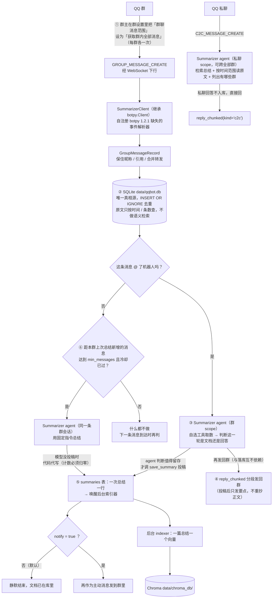
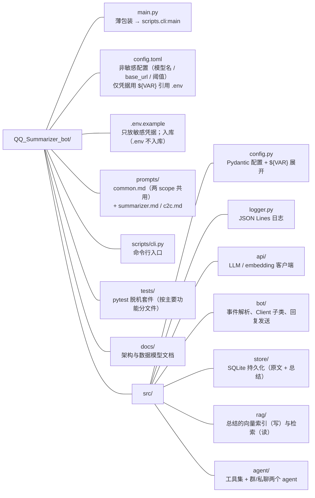

# QQ_Summarizer_bot

QQ 群消息总结机器人。常驻在线接收群聊消息并落库，**被 @ 时**按用户的指令（"今天聊了什么""之前有人提过 X 吗"）回答本群内容，**消息攒够一定量也会自动总结一次**；**agent 认为值得长期留存的那一份总结才会成为知识文档**，被索引进向量库，私聊机器人即可就这些文档跨群提问，也可以按时间范围翻某个群的聊天原文。

基于 `qq-botpy`（QQ 官方机器人 SDK）+ LangChain 工具调用 agent。

---

## 功能

- **接收群内全部消息**：不只是 @ 机器人的消息（需群主在群设置里开一个开关，见下方「使用前提」；**已上真机验证**）。
- **自建消息库**：官方不提供拉取历史消息的接口，所以机器人上线后的每条群消息都会落进本地 SQLite。
- **两种触发方式**：被 @ 时按指令回答或总结；此外每个群"距上次总结新增 ≥ `min_messages` 条"时会**自动总结一次**，默认静默入库、不发群消息（`notify = true` 可改成顺带发到群里）。
- **入库由 agent 决定**：被 @ 不一定产生文档——**只有它认为这一轮值得长期留存时**才调 `save_summary` 投稿。"有没有人提过 X"这类三行字的答复会正常回到群里，但不会变成一篇文档，知识库因此不会被小问答稀释。投稿前它还会先用 `summaries_in_range` 按**覆盖时段**自查库里有没有写过这段，避免近重复。
- **文档单位 = 一次总结**：不是每条消息一个向量，而是每篇投稿一篇文档，再异步建索引。成本不随消息量增长，检索命中的也是一段结论而不是一句碎片。
- **群里只发要点**：投稿之后，回到群里的是「已收录 + 覆盖范围 + 两三行要点」，全文不重抄一遍（省一次长正文的生成）。想读全文就在群里再问一次，或私聊检索——那一次不会重复入库。
- **动态决定总结范围**：LLM 根据用户指令自己选工具——取最近 N 条 / 按时间范围取 / 对历史总结做语义检索 / 读库里某一篇原文。
- **机器人能自述改动**：群里或私聊问「最近新增了什么功能」「那个问题修了吗」，它会调 `changelog()` 读本项目的更新记录。工具**只能读这一个文件**（路径写死在代码里，没有任何文件参数——同目录下的 `.env` 装着 QQ `clientSecret` 与两个 api key），且要说清那里的日期是**开发时间**，不是群聊时间。
- **群隔离**：群内问答只能读到当前这一个群的消息与总结，群标识由服务端注入，模型无法指定。
- **私聊跨群检索**：私聊机器人可以用已有的总结回答"哪个群聊过 X"，也可以用按时间范围读**聊天原文**核对原话、找细节。
- **被动回复合规**：自动分段（≤5 条）、`msg_seq` 递增、接近 5 分钟窗口时降级为主动消息（私聊不降级）。

---

## 工作原理



值得注意的是 **①**：botpy 1.2.1 的实现里没有 `GROUP_MESSAGE_CREATE` 这个事件，事件推过来会被它打一行日志后直接丢掉。本项目通过继承 `Client` 注册缺失的解析器补齐（见 `docs/ARCHITECTURE.md`）。

**⑥ 为什么可以直接在消息回调里 `await` 一次总结**：botpy 把每个事件都放进独立的 asyncio Task（`client.py:250` 的 `create_task`），所以等待总结不会卡住 WebSocket 读循环，也不会拖住别的群。判定本身是同步的（读配置 + 内存冷却 + 一次走索引的计数查询），只有通过判定才真的调模型。

**私聊为什么能读原文**：私聊的入口就是开发者通道——QQ 私聊没有别的鉴权手段，访问面由平台层（谁有资格私聊这个机器人）收敛，应用层再用 `[c2c] allowlist` 兜底。在这个前提下，给私聊一个按时间范围跨群取原文的工具，正是"对知识库做 RAG"所需的能力。群内 agent 则**没有**这个工具：能力差异直接体现在两个 agent 的工具集上，而不是运行时开关。

---

## 快速开始

### 环境要求

- Python **>= 3.13**（`.python-version` 锁定）
- [`uv`](https://docs.astral.sh/uv/)

### 安装

```bash
uv sync
```

### 配置

```bash
cp .env.example .env
```

然后在 `.env` 里填凭据 —— **只放敏感的 key**：

| 变量 | 说明 |
|:---|:---|
| `QQ_APPID` / `QQ_SECRET` | QQ 开放平台 → 机器人管理端 → 开发设置（appid 不算密钥，但与 secret 成对使用，放一起不容易漏填） |
| `LLM_API_KEY` | LLM 网关的 key |
| `EMBED_API_KEY` | embedding 网关的 key（可与 `[llm]` 不是同一个网关） |

`.env` 已在 `.gitignore` 中，**不要把真实凭据提交进仓库**。

**模型名与网关地址不是密钥，直接写在 `config.toml`** —— 换网关、换模型只改这两行，不必动 `.env`：

| 段 | 关键项 |
|:---|:---|
| `[qq]` | `is_sandbox`（新版管理端一般填 `false`） |
| `[llm]` | `model` / `base_url`（留空 = OpenAI 官方端点）/ `temperature` / `max_tokens` / `timeout` |
| `[embedding]` | `model`（**必需**，留空会在启动时明确报错）/ `base_url` / `batch_size`（默认 25，保守值；网关吃得下更大批再调高 `MAX_EMBED_BATCH`） |
| `[store]` | SQLite 路径、Chroma 路径与 collection 名（`summaries`） |
| `[summary]` | `default_recent_n` / `max_reply_chars` / `max_replies` / `passive_reply_deadline_s` / `min_publish_chars`（投稿正文下限）/ `max_publish_per_run`（一次回答最多投几篇）/ `max_doc_reads`（一次回答最多读几篇旧稿） |
| `[auto_summary]` | `enabled` / `min_messages`（阈值）/ `cooldown_s`（两次尝试的最小间隔）/ `notify`（是否发到群里）/ `groups`（白名单，空 = 全部群）/ `instruction` |
| `[c2c]` | `enabled` / `allowlist`（空 = 任何人可私聊检索）/ `max_groups_shown` / `raw_limit`（一次取原文的条数上限） |
| `[groups]` | 可选的群 `openid` → 人话名字映射，会出现在私聊回答里 |
| `[logging]` | 日志级别与目录 |

`config.toml` 里的 `${VAR}` 会在启动时从 `.env` 展开；某个变量没设时保持原样，对应配置项按"未设置"处理（而不是把 `"${VAR}"` 当成真的值发出去）。留空的 `model` 会在启动时直接报错 —— 模型名没有可用的默认值。

`[auto_summary]` 的默认值是：每群累计 200 条新消息触发一次，两次尝试至少间隔 1800 秒（**失败也算**，否则网关出故障时每条消息都会重试一次）。消息密的群把 `min_messages` 调大，只想让部分群自动总结就用 `groups` 列 openid，不想要就 `enabled = false`。`qqbot stats` 的「待总结」列就是离触发还差多少。

### 运行

```bash
uv run qqbot run          # 启动机器人（长驻进程）
```

---

## 命令

| 命令 | 作用 |
|:---|:---|
| `uv run qqbot run` | 启动机器人。长驻，需真实 QQ 凭据 |
| `uv run qqbot stats` | 查看各群消息数、总结数、已索引数，以及「距上次总结新增了多少条」（自动总结的触发依据） |
| `uv run qqbot summaries [--group <openid>] [--limit N]` | 列出已入库的总结（这是知识库的真实内容），并标明每篇是**被 @ 触发**还是**自动生成** |
| `uv run qqbot reindex [--reset]` | 把 SQLite 里的**总结**灌进向量库；`--reset` 先清空向量与索引标记再全量重建 |
| `uv run qqbot media [--status pending] [--limit N]` | 图片附件的处理状态一览（M2，只读排查：谁在排队、谁已落盘、谁过期/失败及原因） |
| `uv run qqbot ask "<指令>" [--group <openid>] [--all] [--save]` | **脱机**跑一次问答（不连 QQ）。`--all` 走私聊 scope 跨群检索总结与原文；`--save` 把这次回答作为总结入库 |

全局加 `-v` / `--verbose` 可让日志同时输出到控制台（默认只写 `logs/app.log`）。

示例：

```bash
uv run qqbot ask "总结最近 50 条"
uv run qqbot ask "今天上午大家聊了什么"
uv run qqbot ask "之前有人提过部署方案吗" --all      # 跨群，走私聊那条路
uv run qqbot ask "把这两天的原始消息列出来" --all    # 私聊还能按时间范围读原文
uv run qqbot ask "总结最近 50 条" --save            # 顺带入库，之后可被检索到
uv run qqbot summaries --limit 5                   # 看看知识库里都有什么
uv run qqbot stats                                 # 看各群离自动总结还差多少条
```

---

## 使用前提 ⚠️

**这一节决定了机器人能不能按设计工作，务必先确认。**

1. **群主开启「获取群内全部消息」（决定性的一步，已真机验证）** —— 只有群主能操作，**每个群要各设一次**：
   - 手机 QQ → 打开该群 → 右上角「≡」群设置 → 「群机器人」里的这台机器人 → 点进去的**机器人设置**；
   - 把「**机器人可获取的群聊消息范围**」设为「**获取群内全部消息**」；
   - 顺手打开「**机器人主动在群聊内发言**」—— 不开就发不出主动消息（`[auto_summary] notify = true` 的那条总结会被平台拒掉）。
   - 这个开关**在手机 QQ 的群设置里，不在开放平台后台**，实测也不需要提交任何审核申请。官方事件页只写了"当机器人开启了『接收所有消息』功能后…"，通篇没给 UI 位置（见 `CLAUDE.md` §1.9），所以这里记的是实测路径。
2. **确认真的生效**：让另一个人（或你自己）发一条**不 @** 的消息，再看 `uv run qqbot stats` 里该群的「消息数」有没有 +1。
   - 生效后：库里每条消息的 `author_name` 有昵称、`event_id` 是**裸消息 ID**；引用消息（`message_type=103`）、图片消息、QQ 表情也都会进来。
   - 没生效：消息会走 `on_group_at_message_create` 退路，`event_id` 形如 `GROUP_AT_MESSAGE_CREATE:<事件id>`、`author_name` 为 `NULL`。看到这个形状就说明权限没打开。
3. **拿不到权限时的降级**：只有 @ 机器人的消息会到达。机器人仍可工作（`on_group_at_message_create` 路径已实现），但**只能总结被 @ 的那条消息**，无法总结群聊上下文。此时摘要里也不会有发言人昵称（botpy 的 `GroupMessage` 拿不到）。
4. **私聊**：私聊事件（`C2C_MESSAGE_CREATE`）与群事件共用 `public_messages` intent，botpy 原生支持，无需申请额外权限；但用户需要在 QQ 里能加机器人好友并打开会话。私聊的可见范围（含原文）见「已知限制」。

另外：发消息接口要求 WebSocket 保持在线，所以机器人必须是常驻进程，不能当离线脚本跑。

---

## 项目结构



`data/`（SQLite + Chroma）与 `logs/` 为运行时生成，已 gitignore。

---

## 测试

```bash
uv run pytest
```

覆盖事件解析、SQLite 去重与时间范围查询、消息正文的文本化落库、图片管线（media 行随消息同事务、落盘/去重/失败分态、`view_image` 缓存与跨群拒绝）、总结入库与索引、**入库由 agent 投稿决定**（下限/上限/闸门各自的拒绝、伪造 `group_openid` 改不了归属、读库动作不污染覆盖时段、重叠查询按覆盖时段而非生成时间、截断必报总数）、回复分段（群 + 私聊）、agent 工具边界与跨群可见性（含伪造 `runtime`/`scope` 的越权尝试）、语音消息的 ASR 转写与无转写占位、以及自动总结的阈值 / 冷却 / 静默与通知 / 同群串行 / **投稿与代写不互踩**、`changelog` 的可见参数只能是 `sections`（越权读文件的防线）与读它不构成投稿依据**等 **78 项测试**，按主要功能分成 `tests/` 下七个文件（共享 fixtures 与假件在 `conftest.py`），全部脱机运行，不需要任何凭据；push / PR 到 main 由 GitHub Actions（`.github/workflows/ci.yml`）自动跑同一套。

---

## 文档

| 文档 | 内容 |
|:---|:---|
| [`CLAUDE.md`](CLAUDE.md) | botpy / LangChain 的 API 事实与坑，全部标注了 `site-packages` 源码行号 |
| [`docs/ARCHITECTURE.md`](docs/ARCHITECTURE.md) | 模块职责、数据流、并发模型、关键设计决策与理由 |
| [`docs/DATA_MODEL.md`](docs/DATA_MODEL.md) | 三层存储、表结构、Chroma metadata、一致性约束 |
| [`CHANGELOG.md`](CHANGELOG.md) | 按日期记录行为 / 配置 / 存储的变化（含兼容性说明：哪次改动动了表结构、哪次没有） |
| [`ROADMAP.md`](ROADMAP.md) | 多模态与会话/记忆两条线的实现顺序与既定取舍 |

---

## 已知限制

- **不补历史**：只总结机器人上线后收到的消息。官方没有拉取历史的接口，这是唯一可行方案。
- **多模态的现状**（推进顺序与方案：[`ROADMAP.md`](ROADMAP.md) + [`docs/MEDIA.md`](docs/MEDIA.md)）：
  - **语音（M1，已实现）**：只取 QQ 官方的 ASR 转写（`asr_refer_text`）渲染成 `[语音转写 …]`；没有转写时记 `[语音（无转写）]` 占位。不存音频文件——能读音频的全模态模型太贵。
  - **图片（M2，已实现）**：字节由后台抓取到本地 `data/media/<消息日期>/<sha256>`（对 URL 限时签名的保险），正文占位带短 id；agent 觉得重要时才调 `view_image` 看图，通用描述缓存回写、第二次看零成本。**代价**：没人调用过 view_image 的图，内容不进语料——与"只有总结过的话题可检索"是同一条既有限制。
  - **PDF / docx / ppt（M3/M4，未做）**：仍是文件占位。
- **QQ 表情码不渲染**：`<faceType=6,faceId="0",ext="…">` 这类原始编码会原样进正文，模型看到的是编码而不是表情。
- **语义检索只覆盖"已成稿"的话题**：入库由 **agent 决定**（它判断这一轮值得长期留存才投稿），所以"被 @ 过"不等于"成稿过"——它可能只当成一次问答。加上还在阈值以下的讨论，这些都没有文档，但**原文仍在库里**，私聊可以用 `messages_across_groups` 按时间范围取到。这是"一篇投稿一篇文档"的必然结果；如果发现知识库涨得太慢，先看 `logs/app.log` 里 `答复判定为问答，未入库` 的频率（判据写在 `prompts/summarizer.md`，那是该调的地方）。
- **私聊可见面 = 所有群的总结 + 原文**：任何能私聊机器人的人都能检索**全部群**的总结**与聊天原文**（含发言人昵称），不只是结论。这是刻意的产品选择——私聊入口由平台层控制谁有资格，`config.toml` 的 `[c2c] allowlist` 是应用层兜底。**不要把这个机器人加进不该看全量消息的群**。
- **自动总结消耗 LLM 配额**：每群每 `min_messages` 条一次（默认 200 条）。活跃群大概一天几次；不想要就 `enabled = false`，或把 `min_messages` 调大。
- **自动总结与被 @ 复用同一条群会话记忆**：所以用户随后的 @ 会看到上一次自动总结的上下文。这通常更连贯，但意味着自动总结的措辞会影响后续回答。
- **冷却只在内存**：进程重启后如果积压仍超阈值，会立刻再自动总结一次（多一篇文档，无害）。
- **总结的时间范围是包络**：agent 可能分别读了"昨天"和"前天"两段，展示出的 `ts_start`~`ts_end` 会覆盖中间那段没读过的区间。精确区间存在 `summaries.coverage_json` 里。
- **重启丢会话记忆**：agent 的多轮记忆在内存里（`InMemorySaver`），进程重启即清空；消息与总结本身不受影响（在 SQLite）。
- **刚产生的总结要等索引器跑完那一批才可被检索**（默认 10 秒一轮，入库时会主动唤醒）。
- **同一群内多个机器人**时，@ 别的机器人也可能触发一次总结（判定仅依据 mentions 里的 `bot` 标志位）。
- **升级自旧版本**：向量 collection 已从 `group_messages` 改名为 `summaries`，旧向量不会被读取（也不由代码删除）。确认不需要后可以手动删掉 `data/chroma_db/` 回收空间。

---

## 许可

MIT，见 [`LICENSE`](LICENSE)。
