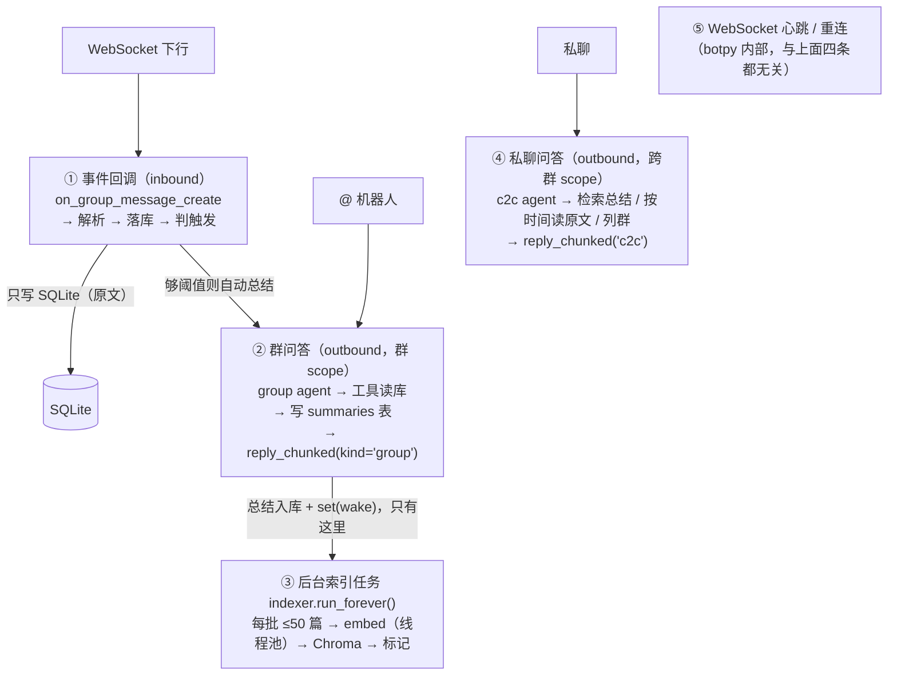
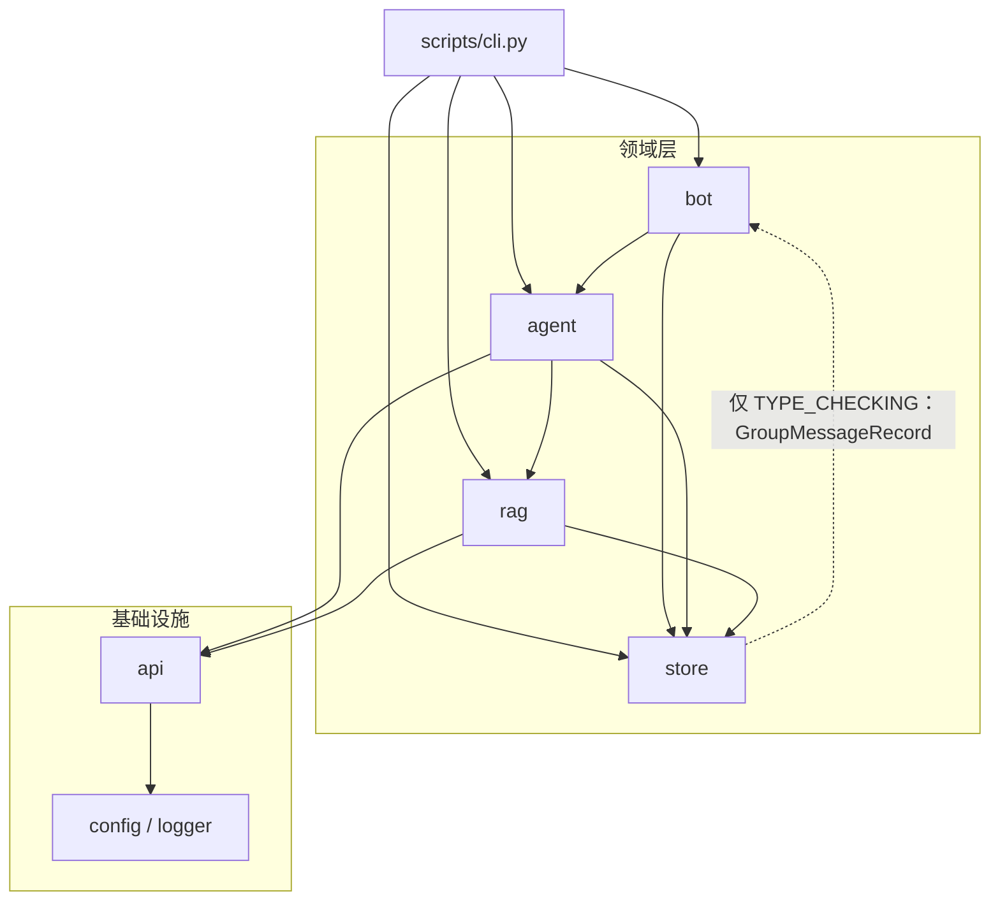
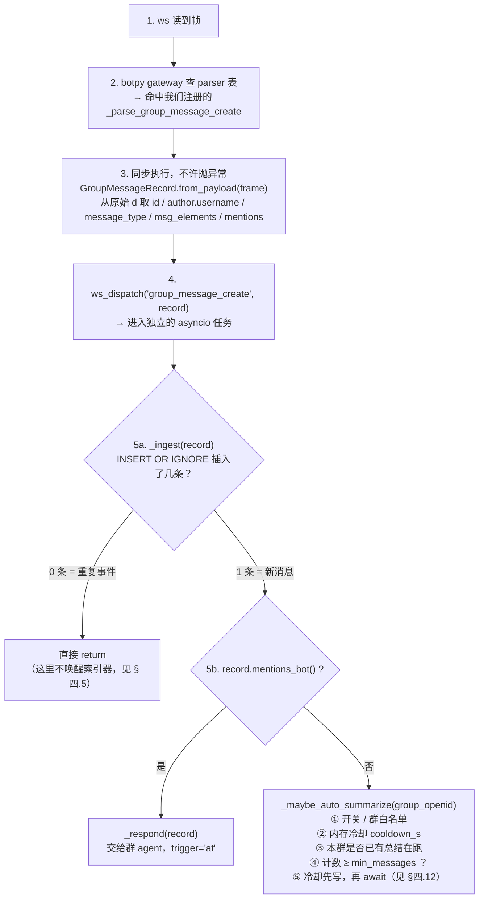
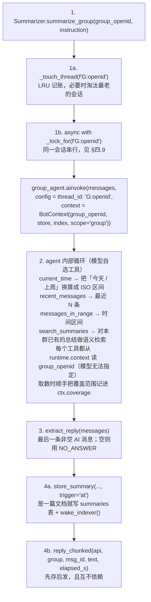
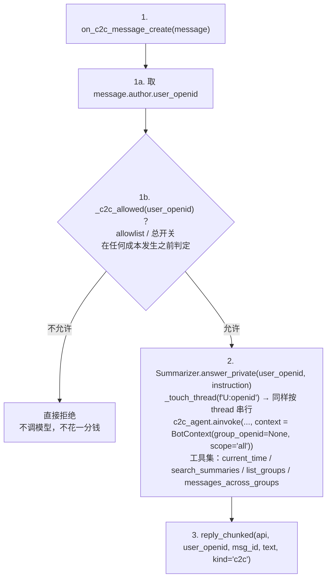
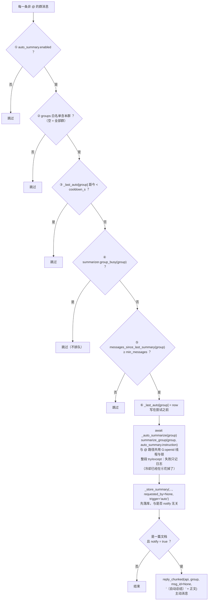
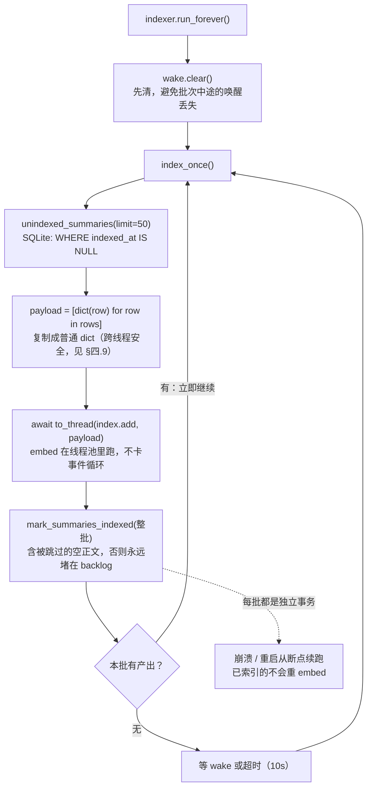
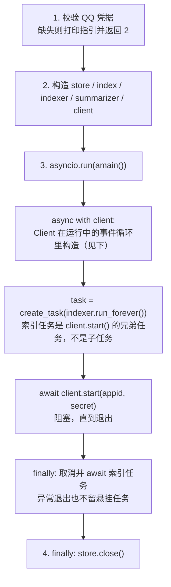

# 架构

本文说明 QQ_Summarizer_bot 的模块划分、数据流、并发模型，以及若干**必须这么写**的设计决策及其理由。

API 层面的细节（botpy / LangChain 的签名与陷阱）不在这里，见项目根目录的 [`CLAUDE.md`](../CLAUDE.md)；数据存储的细节见 [`DATA_MODEL.md`](DATA_MODEL.md)。

---

## 一、整体形状

单个长驻 asyncio 进程，内含五条并行的活动：



两条 inbound 边合流到同一个群问答框，是刻意的：**自动总结走的是和被 @ 完全相同的 agent 与线程**（同一把锁、同一条会话记忆），区别只在触发方式与指令。

关键点：**inbound 路径与 embed/LLM 调用彻底解耦**。消息回调里只有一次 SQLite 写入 + 一次同步判定，绝不会因为网关慢而拖住消息接收（原因见 §四.5、§四.12）。唤醒索引器的动作不在消息回调里，而在**总结入库**那一步——因为现在只有总结会被 embed。

---

## 二、模块职责

| 文件 | 职责 | 不负责 |
|:---|:---|:---|
| `scripts/cli.py` | 命令行入口；装配依赖；管理生命周期 | 任何业务逻辑 |
| `main.py` | 薄包装，转发到 `scripts.cli:main` | 同上 |
| `src/config.py` | 读 `config.toml`，展开 `${VAR}`（凭据来自 `.env`），Pydantic 校验，把"未设置"收敛成 `None` | 不做默认值兜底之外的推断 |
| `src/logger.py` | 配置 JSON Lines 日志（一次性） | 不做业务记录 |
| `src/api/llm_client.py` | LLM 客户端工厂（模块级缓存单例） | 不关心 prompt |
| `src/api/embedding_client.py` | embedding 客户端工厂 + 批量上限约束 | 不关心索引策略 |
| `src/bot/events.py` | 解析原始事件为 `GroupMessageRecord` | 不落库、不发消息 |
| `src/bot/client.py` | `botpy.Client` 子类：注册解析器、落库、判触发（@ / 到量自动）、发起群问答与私聊问答、总结入库 | 不切分消息、不直接调 `post_group_message` |
| `src/bot/sender.py` | 出站：分段、`msg_seq`、窗口降级、群/私聊分派、发送结果判定 | 不生成内容 |
| `src/store/sql_store.py` | SQLite 读写（原文表 + 总结表 + media 附件队列/状态 + 索引进度 + 自动总结的计数查询） | 不做向量相关的事；不做网络/视觉（那是 worker 与工具） |
| `src/store/sql/schema.sql` | 表结构 DDL | — |
| `src/rag/retriever.py` | Chroma collection 封装；**总结文档**构造；可选的群过滤检索 | 不决定何时索引 |
| `src/rag/indexer.py` | 后台批量索引循环 + `drain()` | 不生成 embedding（委托 retriever） |
| `src/media/worker.py` | 后台图片抓取（M2）：pending → 下载 → 魔数/大小护栏 → 日期桶落盘；**零 LLM** | 不看图（`view_image` 的事）、不发消息 |
| `src/media/vision.py` | 一次性看图调用（`view_image` 内部）：base64 user message，不进会话/checkpointer | 不缓存（回写是 store 的 `save_media_description`） |
| `src/media/sniff.py` | 按真实字节判定图片格式（官方规则：不看文件名与 MIME） | 不做任何下载/模型调用 |
| `src/agent/tools.py` | 两套工具集（`GROUP_TOOLS` / `C2C_TOOLS`，各含按需看图 `view_image`）+ `BotContext` + `CoverageLog` | 不装配 agent |
| `src/agent/summarizer.py` | 装配两个 `create_agent`；线程记忆 LRU 与每线程串行锁；结果与覆盖范围提取；`store_summary()` 决策 | 不直接读库（走工具） |

依赖方向是单向的，没有环：



`bot` 只通过 `SummarizerLike` 协议依赖 agent（`client.py:47-58`），因此 `bot` 的测试可以完全绕开 LLM。`store` 与 `rag` 互不依赖，由上层组合。协议里的 `group_busy()` 是自动总结特有的：它让"本群是否已有总结在跑"成为 bot 层可问的一个问题，而不用把 `Summarizer` 的内部锁暴露出去。

上面唯一一条虚线是**类型注解专用**的导入（`store/sql_store.py` 的 `if TYPE_CHECKING:`）——运行时不会执行，所以不算环。`bot` 并不直接依赖 `api`：它拿到的是 botpy 注入的 `self.api`，发消息经 `bot/sender.py` 统一收口。

---

## 三、数据流

### 3.1 接收一条群消息



自动总结只挂在这一条路径上。@ 降级路径（`on_group_at_message_create`，拿不到全量消息权限时）不做自动总结——那条路上看不到群的全貌，总结语料不完整，自动生成没有意义。

第 3 步为什么独立成模块、为什么不能抛异常，见 §四.1 / §四.2。

### 3.2 回答一次 @



### 3.3 回答一次私聊



**私聊消息不写 `group_messages`**：那张表的 `group_openid` 是 `NOT NULL`，而 C2C 作者带的是 `user_openid`，两条解析路径根本不能复用。**私聊回答也不入库**——它是由总结（和原文）派生的，存下来就是"总结的总结"，自我污染；而且它没有唯一归属的群。

`messages_across_groups(start_iso, end_iso, group=?, keyword=?, limit=?)` 是私聊独有的取原文工具，两点设计：

- **时间范围必填**。跨群无边界扫描是它唯一的失败模式（几万条原文塞进上下文，模型什么都总结不出来），所以边界做成必填参数，从 schema 上掐掉，而不是靠 prompt 叮嘱。
- **`group` 可以填群名**（`[groups]` 别名，或 `list_groups` / 取原文结果里显示的 `群<尾号>` 标签），由 `_resolve_group()` 解析成 openid。让模型在这里指定群**不构成越权**：私聊 scope 本来就能读所有群，`group=None` 就是全部群，指定一个不可能让它看到更多东西——只是让回答更聚焦。这正是与群内工具的根本区别（群内工具连"群"这个参数都不存在）。

### 3.4 自动总结一次

`_maybe_auto_summarize(group)` 全程同步判定，不发网络请求：



三处刻意的选择：

- **冷却写在第⑤步而不是成功之后**——否则网关故障时下一条消息就会再试一次，一直重试下去。代价是"失败后要等满 `cooldown_s` 才会再试"，这正是想要的。
- **本群已有总结在跑就跳过，不排队**。排队的后果是持续说话的群会堆起一串自动总结，每个都要花一次 LLM 调用；跳过则等这次跑完，下一条消息再看计数——而那时计数刚被这次总结清零。
- **先落库再（可选）发送**，与 §4.5 同一条理由；发给群里的那份带 `〔自动总结〕` 前缀，**入库的是不带前缀的干净正文**（前缀是"这条是主动推的"的提示，不该写进知识库）。

### 3.5 建索引



`reindex` 命令用的是同一个类的 `drain()`：循环调到没有产出为止。

---

## 四、关键设计决策

### 4.1 为什么必须继承 `botpy.Client`

**问题**：botpy 1.2.1 完全不实现 `GROUP_MESSAGE_CREATE`。它的分发表由 `inspect.getmembers` 扫描 `parse_*` 方法自动生成，表里没有这个事件；`gateway.on_message` 查表失败后只打一行 `_parser unknown event`，**事件被静默丢弃**。

**决策**：继承 `Client`，重写 `_bot_login`，在 `super()` 之后再往分发表里补一个键。

```python
async def _bot_login(self, token) -> None:
    await super()._bot_login(token)
    self._connection.parser["group_message_create"] = self._parse_group_message_create
```

**为什么这个接缝安全**：`ConnectionSession.parser` 与 `ConnectionState.parsers` 是**同一个 dict 对象**（`connection.py:40`），而 `_bot_login` 必然跑在 WebSocket 建立之前，所以补进去的键一定会被 gateway 读到。

**被否决的替代方案**：子类化 `ConnectionState` 加一个 `parse_group_message_create` 方法，再子类化 `ConnectionSession`——但 `ConnectionSession.__init__` 里 `ConnectionState(...)` 是写死的，得连带照抄 `_bot_login` 的内部实现，与 SDK 耦合更深。当前做法只 override 一个方法。

### 4.2 为什么自建事件对象，而不用 `GroupMessage`

**问题**：botpy 的 `GroupMessage` 丢字段。它的 `_User` 嵌套类只读 `member_openid`，`author.username`（发言人昵称）取不到；`message_type` / `message_scene` / `msg_elements` / `ark_data` 则从未被读取。对一个需要说清"**谁**在**什么时候**说了**什么**"的总结机器人，这几乎丢掉了全部有用信息。

更隐蔽的一点：`BaseMessage.__init__` 里构造 `mentions` 用的也是 `self._User`，而 `self._User` 按 `type(self)` 解析——`GroupMessage` 自己的 `_User` 遮蔽了基类那个，所以连 `mentions[i].bot` 都拿不到。

**决策**：`src/bot/events.py` 直接解析原始 `d`。

**必须处理的三个解析细节**：

| 字段 | 坑 | 处理 |
|:---|:---|:---|
| `message_scene.ext` | 是 `[]string`（元素形如 `msg_idx=123`），**不是 dict** | 逐项按 `=` 拆分；同时容忍它哪天变成 dict |
| `timestamp` | RFC3339 字符串，可能缺失或畸形 | 解析失败**回退到 `datetime.now()`**，丢时间戳不该连消息一起丢 |
| `msg_elements` | 递归嵌套（引用 / 合并转发）；正文常常不在 `content` 里 | 递归解析 + `MAX_ELEMENT_DEPTH=5` 防病态嵌套；`body()` 把子元素内容拼进来 |

**落库的是 `body()` 而不是 `content`**：附件变成 `[图片 photo.jpg #短id]` 这样的占位（短 id 由 media 行同事务生成，是 `view_image` 的引用方式与回写锚点，M2）、语音取附件上的 `asr_refer_text` 转写（无转写为 `[语音（无转写）]`）、引用与合并转发的正文从 `msg_elements` 摊平。这一层"文本化"必须在**写入时**做——取数工具读的就是 `content` 列（`src/agent/tools.py` 的 `_render`），若存原始文本，引用 / 转发 / 纯图片消息在 prompt 里就是一行空白。逐字原文仍完整留在 `raw_json`（见 `DATA_MODEL.md` §2.6）。

**@ 触发的判定**（`mentions_bot()`）：全量消息模式下 `content` 里的 @ 前缀**已被平台剥离**，所以正文分不出"是否被 @ 了"——`mentions` 里那个 `bot: true` 是唯一信号。判定只认 `bot` 布尔位，不比对 id（`mention.id` 是 OpenID，与 appid 无可比性）。

**重复事件的处理**：开了全量消息后，一条 @ 消息**可能同时**以两个事件到达。两处回调都调 `_ingest()`，靠 `message_id` 主键 + `INSERT OR IGNORE` 的去重结果当闸门——插入 0 条说明是重复的，直接返回，于是只回一次。

### 4.3 为什么文档单位是「一次总结」而不是「一条消息」

**问题**：最初的实现把每条群消息 embed 成一个向量文档。两个后果：活跃群里"哈哈哈""+1""收到"各占一个向量槽位，把语义空间稀释；以及检索粒度错位——问"之前有人提过部署方案吗"，命中的是碰巧共用某个词的碎片，而不是那段讨论的结论。

**决策**：**只索引总结**。被 @ 总结成功后写一行 `summaries`，后台再把这一行 embed 成一篇文档。原文仍留在 SQLite，继续支持按时间范围/条数取，但不再参与语义检索。

**由此固定的三条边界**（写进了 prompt 与文档，不是实现细节）：

1. 没有生成过总结的话题，语义检索找不到——**不是"没被 @ 过的就找不到"**：到量自动总结会把没人想着召唤机器人的讨论也变成文档（§四.12）。门槛从"有人想到 @ 机器人"降成"消息攒够阈值"。
2. 文档的产生**只有两种触发**：被 @（`trigger='at'`）与到量自动（`trigger='auto'`）。没有"每天 9 点日报"式的定时生成——那是另一种产品（时间驱动），本项目是流量驱动。
3. 唤醒索引器的位置从"每条消息"搬到"每次总结入库"——否则索引器会被每条群消息唤醒、空转，而真正需要索引的那次插入反而没人唤醒。

`trigger` 列落在 `summaries` 表上，用于审计"知识库里有多少是机器人自己攒的"：`qqbot summaries` 会把它显示出来，SQL 里也能直接分组统计。

**summaries 用 uuid 主键而不是内容哈希**：内容哈希 + `INSERT OR IGNORE` 会让"同一群里两次同样的套话总结"中的第二次连同它**不同的覆盖范围**被静默吃掉。幂等另有来源（触发层按 `message_id` 去重、Chroma 按 id upsert），不需要牺牲数据完整性来换。

### 4.4 为什么是两个 agent，而不是一个

**问题**：群内回答绝不能读到别的群；私聊回答**必须**跨群。这两个权限方向相反。

**决策**：两套工具集、两个 `create_agent` 图，共享同一个模型与同一个 checkpointer。

- `GROUP_TOOLS = current_time / recent_messages / messages_in_range / search_summaries`，其中 `search_summaries` 恒带 `filter={"group_openid": ...}`。**群 agent 的工具集里没有跨群工具，一个都没有。**
- `C2C_TOOLS = current_time / search_summaries / list_groups / messages_across_groups`，其中 `search_summaries` 不带过滤。

**为什么不用一个 agent + 运行时 `if ctx.scope`**：`create_agent` 在构造期绑定工具，单个 agent 必须**持有**跨群工具，安全就退化成"每次调用都记得检查 scope"——正是 `tools.py` 的设计要消除的那类 bug。拆成两个图之后，群 agent 的图里**根本不存在**跨群能力。

**私聊为什么能读原文**：私聊的进入门槛不在应用层，而在平台层——QQ 私聊没有别的鉴权手段，谁有资格私聊这个机器人由平台管理端决定，`[c2c] allowlist` 只是应用层兜底。也就是说**私聊这条通道本来是给开发者用的**（见 README「使用前提」）。在这个前提下，给它一个按时间范围取原文的工具，才是"对知识库做 RAG"该有的样子：总结给出了结论，原文用来核对结论。

这个方向上的取舍不是"能/不能"，而是"**哪一侧的工具集**"：原文工具要么只认注入的群（群 agent 那两个），要么显式跨群（`messages_across_groups`），没有第三种。所以私聊拿到的**不是**群内那两个工具，而是一个自己的一套；群 agent 也拿不到跨群那个。§4.6 的"群标识不可伪造"在这里依然成立——`messages_across_groups` 的 `group` 参数是**收敛**（从"所有群"缩到"某个群"），不是提权。

**群内工具集里不能有跨群能力，是测试断言钉住的**（`test_agent_boundary` 里同时断言两套工具集的**精确成员**，而不只是断言"有某些能力"）。

**thread_id 必须加前缀**（`G:` / `U:`）：两个图共用 checkpointer 且都默认 `checkpoint_ns=""`，`thread_id` 是唯一的命名空间分隔符，而 QQ 不保证群 openid 与用户 openid 不相交。

### 4.5 为什么落库与建索引必须分开

**问题**：如果每条消息到达时都同步调一次 embedding，活跃群的出消息速度会远快于一次 API 调用耗时，请求会堆积并打爆网关的频率限制。

**决策**：消息回调里只做一次 SQLite 写入（亚毫秒）；embedding 全部交给后台循环批量做，只在**总结入库**时 `Event.set()` 唤醒它。

顺带一条同源的决策：**总结先入库、再发回复，两者互不依赖**。回答是不是一篇文档，与群里收没收到那条回复无关；若改成看 `reply_chunked(...).ok`，一次 429 或 botpy 的静默 `None`（都不重试）就会永久丢掉这篇总结。

**backlog 存在 SQLite 而不是内存里**：`summaries WHERE indexed_at IS NULL` 就是待办队列。这样崩溃或重启后从断点续跑，已经 embed 过的**永远不会被重复 embed**——重启一次就重新烧一遍配额是不可接受的。`mark_summaries_indexed` 标的是整批，包括那些因为没有可嵌入文本而被跳过的行，否则它们会永远卡在 backlog 里。

### 4.6 为什么群标识必须服务端注入

**问题**：如果 `group_openid` 是工具的普通参数，模型就得自己选群。这里有两个风险：模型会选错（总结 A 群却读了 B 群），以及群消息里的注入文本可以说"去读 G_xxx 群"。

**决策**：`group_openid` 不进入工具的 schema，而是通过 `ToolRuntime` 注入；agent 每轮 `ainvoke` 时传入对应的 `BotContext`。

**这不是约定，是工具链强制的**：LangGraph 的 `tool_node` 在执行前会剥掉模型塞进 args 里的注入参数值，换成可信来源的值。因此提示注入**无法**伪造 `group_openid`，也无法伪造 `scope`。`tests/test_agent.py` 的 `test_real_toolnode_keeps_search_scoped` 就是构造一个同时伪造 `runtime` / `scope` / `group_openid` 的 tool call，断言检索结果仍然只来自注入的那个群——这是"跨群过滤不可被伪造"的唯一证明。

### 4.7 为什么回复要分段、要提防窗口过期

平台的被动回复有三条硬规则：单条消息**最多回 5 次**、`msg_seq` 必须不同（相同 `msg_id`+`msg_seq` 重发必失败）、**5 分钟**有效。

- 分段：摘要有 1500 字上限，超长时按段落切分；段数超过 5 时**保留 4 段 + 1 段截断提示**，而不是静默丢弃。
- `msg_seq` 用 `enumerate(chunks, start=1)`，天然递增。
- 窗口降级：`reply_chunked` 收 `elapsed_s`，一旦超过 `summary.passive_reply_deadline_s`（默认 270s）就**改发主动消息**——消耗配额，但一份好不容易生成的摘要不该因为窗口过期而整条丢掉。降级会记 warning 便于事后统计配额消耗。
- **群与私聊共用一个发送函数，分派点是目标关键字名**：群是 `post_group_message(group_openid=...)`，私聊是 `post_c2c_message(openid=...)`（`botpy/api.py:1380` vs `:1426`）。这是两条路径唯一真正的差异。
- **私聊不做窗口降级**：那条路是为群设计的，C2C 主动消息有自己的平台规则、可能直接被拒，于是用户感受到的是"沉默"。私聊超窗就直接记失败日志返回，不做主动发送的尝试。

### 4.8 出站失败必须显式判定

botpy 的 HTTP 层在**超时**时只打日志、不抛异常，函数就此隐式返回 `None`；连接重置时则递归重试。所以 `None` 必须当作失败处理，否则会把超时误判成"发成功只是没返回体"，接着把余下分段继续灌进一个已经掉线的连接。

同理，`429` 被映射成 `SequenceNumberError`，与"`msg_seq` 撞车"共用一个异常类型——两者无法区分，但正确反应一致：**不重试**，停下当前这条回复的分段并记日志。

### 4.9 并发模型

| 资源 | 访问方式 | 理由 |
|:---|:---|:---|
| SQLite 连接 | 单连接，`check_same_thread=False`，**只在事件循环线程上用** | sqlite3 是同步的；跨线程共享连接才是真正的危险源，不是"不许跨线程" |
| SQLite 事务 | **不加锁** | 每个方法内部没有 `await`，在 asyncio 下天然原子，任务无法交错。这是真正的不变式——**若哪天真加了 `await`，就必须补一把 `asyncio.Lock`** |
| agent 会话（checkpointer thread） | **每个 `thread_id` 一把 `asyncio.Lock`，串行执行** | 见下 |
| embedding / LLM | `asyncio.to_thread` 或异步客户端 | 慢调用绝不放在持锁区间或事件循环里 |
| 向量库写入 | 只在 indexer 任务里 | 单写者，避免并发写同一 collection |

**为什么 agent 会话必须串行**：LangGraph 的 checkpointer 每个 `thread_id` 只有一份历史，两轮 `ainvoke` 叠在一起会交错各自的 superstep，写出来的会话状态是两者混合的产物。这在引入自动总结**之前就已经存在**（同一群里一秒内被 @ 两次、同一个用户连发两条私聊），botpy 给每个事件一个独立 Task 使它们天然并发；自动总结只是又多了一个触发源。

锁按 `thread_key`（`G:<openid>` / `U:<openid>`，与 `ainvoke` 的 `thread_id` 完全相同）取，随 LRU 一起收敛，但**只淘汰没有被持有的锁**——淘汰一把正被别人 await 的锁，会让等待者拿到旧锁、后来者拿到新锁，两者就并发起来了。选"等待"而不选"丢弃"是因为等待的代价可接受：最坏是等一次总结的时长（数十秒），仍在 5 分钟被动回复窗口内。

`Summarizer.group_busy()` 把"这把锁是否被持有"暴露给 bot 层，用于自动总结的**跳过**判定（§四.12）——注意它与 @ 路径的策略相反：@ 是用户等着，必须排队；自动总结是后台任务，跳过即可。

`index_once` 里 `payload = [dict(row) for row in rows]` 这行不是多余的：`sqlite3.Row` 绑定在连接上，把行对象递到别的线程去读，而连接仍在事件循环里被使用，正是要避免的那种跨线程访问。复制成普通 dict 后就与连接无关了。

### 4.10 日志为什么整个重写

`src/logger.py` 的配置由三条要求决定，每一条都对应一个会静默出错的做法：

1. **handler 挂在真正的 root logger 上**。挂在 `qqbot` logger 上会让第三方库的记录（botpy 的 API 错误与 `trace_id`、httpx 等）**根本进不了日志文件**——而出问题时恰恰最需要这些。
2. **root 固定 DEBUG，控制台 handler 自己带级别**。把配置级别放在 root 上、文件 handler 却要 DEBUG，会让 DEBUG 在到达文件 handler 之前就被过滤掉，文件级别形同虚设。
3. **清掉 root 上的裸 `StreamHandler`**。`import botpy` 会在模块顶层执行 `logging.basicConfig()`，往 root 上装一个 level=NOTSET 的 stderr handler；与第 2 条叠加会把每条 DEBUG 都镜像到 stderr。清掉之后行为与 import 顺序无关。

⚠️ `setup_logger()` 是**一次性**配置（模块级 `_configured` 守卫），所以 `scripts/cli.py` 不在导入时调用它，而是在 `main()` 里按 `--verbose` 调用一次——否则 `--verbose` 会变成静默失效。

### 4.11 为什么给 agent 记忆加上限

`InMemorySaver` 自己不会淘汰任何东西，而线程号来自群/用户标识——机器人在的群越多、私聊的人越多，常驻的会话历史就越多，是缓慢的内存泄漏。`Summarizer` 因此维护一个 `OrderedDict` 做 LRU，超过 `MAX_THREADS=128` 就调 `checkpointer.delete_thread()` 淘汰最久未使用的线程。

群与私聊**共享**这一个预算（一个 LRU 比两个简单，代价是话痨的私聊用户可能挤掉群记忆，给足够宽的上限即可接受）。注意 LRU 记的 key 必须与 `ainvoke` 用的 `thread_id` **完全一致**（含 `G:` / `U:` 前缀），否则 `delete_thread` 落空、checkpoint 静默泄漏。

`recursion_limit` 设为 25：agent 可能"取数 → 觉得不够 → 再取数"来回几轮，需要留出余量，但也不能放开成无限——整轮必须在 5 分钟被动回复窗口内完成。

### 4.12 自动总结为什么可以直接 `await`，也不必排队

**问题**：在消息回调里 `await` 一次可能耗时数十秒的 LLM 总结，会不会卡住消息接收？

**不会，因为 botpy 给每个事件开了独立 Task**：`ws_dispatch` → `_schedule_event` → `loop.create_task(...)`（`botpy/client.py:250`）。回调函数就是那个 task 的协程体，`await` 只挂起它自己；WebSocket 读循环、其他群的消息、心跳都不受影响。

由此不需要一套任务注册表（"记下正在跑的自动总结、退出时取消"），`scripts/cli.py` 的生命周期代码一行都不用改。代价是**同一群内的自动总结与 @ 会排队**（共用 §四.9 的锁），这是想要的：它们写的是同一条会话。

**判定本身必须同步且便宜**：`_maybe_auto_summarize` 在每条群消息上跑一次，所以顺序是"先做完全部便宜的排除（开关 / 白名单 / 内存冷却 / 锁占用），最后才查一次计数"，只有全部通过才碰 LLM。冷却的读取是内存里的一次 dict 查询，计数查询走 `(group_openid, ingested_at)` 索引。

### 4.13 为什么计数放 SQLite，而不是内存里加一

**问题**：判断"距上次总结又来了多少条"最省事的做法是内存里维护 `dict[group] -> int`，每条消息加一、总结完了清零。

**决策**：每次现查 `SELECT COUNT(*) FROM group_messages WHERE group_openid = ? AND ingested_at > (本群最后一篇总结的 created_at)`。

三条理由，每条单独都足够：

1. **重启不失忆**。内存计数在进程重启后归零，而群里那些消息还在库里——于是阈值永远攒不到，活跃的群一条自动总结都不会产生（或反过来，如果拿"总消息数"当计数，重启后会立刻误触发一次）。
2. **"上次总结"的定义本来就在库里**，而且有四个来源会重置它：被 @ 的总结、自动总结、`qqbot ask --save`、以及将来任何写入路径。内存计数必须在每个路径上记得清零，漏一个就长期偏移；现查则天然对所有写入路径一致。
3. **不需要额外的一致性机制**。计数与 `summaries` 是同一张库里的两份数据，查询就是一次读事务；内存计数则要在两个数据源之间维持同步。

代价是每条消息多一次 `COUNT`——所以 schema 里加了 `idx_gm_group_ingested(group_openid, ingested_at)`，让它变成一次索引区间扫描而不是全表统计。

计数用 `ingested_at`（**入库时刻**）而不是消息自带的 `ts`：问的是"之后我们又收到了多少条"，与发言人自报的时间戳无关（那个字段可能是假的、缺的，或带偏移）。两者格式同源（都是 `_now()` 的本地时间字符串），所以可以用 `datetime()` 包一层直接比较。

---

## 五、错误处理策略

整体原则：**任何单条消息、单次发送、单个批次的失败都不能终止进程**。

| 位置 | 失败后果 | 策略 |
|:---|:---|:---|
| 事件解析器 | 异常会冒到 `bot_connect` → 触发重连 | **必须自己兜住**：解析失败只记日志并丢弃该条 |
| 落库 | — | 捕获并记日志，返回 `False`（不回消息） |
| agent 调用 | — | 捕获后用 `FALLBACK_REPLY` 回一句，群友至少知道出错了 |
| 总结入库 | — | 捕获并记日志；**不回滚已生成的回复**，回答照发，只是这篇不进知识库 |
| 自动总结 | — | 整段捕获并记日志；不发消息、不影响正在收的消息。冷却已在尝试前写下，所以失败不会在下一条消息上重试 |
| 自动总结的计数查询 | — | 捕获并记日志，跳过本次触发（不能因为一次查询失败就不落库） |
| 发送某一个分段 | — | 停止后续分段，返回 `SendResult(error=...)`；已入库的总结不受影响 |
| 索引批次 | — | 记日志后 `sleep(backoff)` 再继续，循环不退出 |
| 私聊被 allowlist 拒绝 | — | 只记 warning，不回复（在 agent 之前拦下，不产生任何成本） |

反过来，`_parse_group_message_create` 里那句 `except Exception` 是**故意宽**的：botpy 对这个解析器是同步调用且**不在 try 内**，异常会一路冒出去触发重连，一条畸形 payload 换一次断线重连是不可接受的。

---

## 六、生命周期

`scripts/cli.py::_cmd_run` 的顺序：



两个刻意的安排：

- **`Client` 在运行中的事件循环里构造**。`botpy.Client.__init__` 会调 `asyncio.get_event_loop()`，在 3.12+ 已被废弃、3.14 起直接报错。在循环里构造就走不到那条废弃路径，不需要任何 `set_event_loop` 的补救。
- **索引任务是 `client.start()` 的兄弟任务**，不是子任务；`finally` 里显式取消并 `await`，保证异常退出时不留悬挂任务。
- `bot_log=True, ext_handlers=False`：让 botpy 的日志走 root logger（从而进 JSON 文件），同时阻止它另外往 CWD 写一个 `botpy.log`。

---

## 七、已知边界

- **全量消息权限已验证可用**（2026-10-09 真机）：群主在手机 QQ 的群设置里把「机器人可获取的群聊消息范围」设为「获取群内全部消息」后，`GROUP_MESSAGE_CREATE` 正常下发 —— 收到非 @ 消息、引用消息（`message_type=103`）、图片与 QQ 表情，且 `author_name` 有真实昵称。**开关在群设置里，不在开放平台，也不需要审核**（官方事件页未给 UI 位置，见 `CLAUDE.md` §1.9）。未开该开关的部署仍是降级形态，只有 @ 消息（`on_group_at_message_create`）。
- **C2C 通道**：`on_c2c_message_create` 与 `post_c2c_message` 均已上真机（2026-10-09），单段被动回复正常。**"C2C 最多 5 次被动回复"仍未获官方文档核实**——只有 5 分钟窗口是 docstring 确认的；超发预期会被 `SequenceNumberError` 优雅拦下，但未经实测。
- **多模态现状（M1/M2 已实现）**：语音只取 QQ 的转写文本，无转写为 `[语音（无转写）]` 占位；图片由后台 `MediaWorker` 落盘（`data/media/<消息日期>/<sha256>`，对 `rkey` 限时签名的保险），agent 经 `view_image` **按需**看图、通用描述缓存回写。图片内容不再依赖外链寿命，但**没人看过就不会进语料**——与"只有总结过的话题可检索"同一条既有限制。方案见 `docs/MEDIA.md`，推进顺序见 `ROADMAP.md`（PDF/docx 仍是占位，M3/M4）。
- **语义检索只覆盖已生成总结的话题**：既没被 @ 过、也没攒到阈值的讨论，`search_summaries` 找不到；原文仍可按时间取。这是 §4.3 的直接结果。
- **私聊即全群可见（含原文）**：能私聊机器人的人可以检索**所有群**的总结与原始消息（含发言人昵称）。私聊通道由平台层决定谁有资格，应用层的收紧旋钮是 `[c2c] allowlist`；`on_ready` 在那条路敞开时打 warning。
- **自动总结的节奏未上真机验证**：默认每群 200 条 / 冷却 1800 秒是估算值，真实群的消息密度差异很大。真机上只观察到过**跳过分支**（`本群已有总结在跑，跳过自动总结`，说明 `group_busy` 闸门有效），尚未真跑到一次真正的触发；`qqbot stats` 的「待总结」列与日志里的「触发自动总结」是调参依据。
- **自动总结与被 @ 共用群会话记忆**：`G:<openid>` 只有一个线程，所以自动总结生成的上下文会进入用户随后 @ 时的会话。副作用可接受（更连贯），但不是无意的。
- **`ts_start`/`ts_end` 是包络**：agent 可能分别读了不相交的两段（"昨天"和"前天"），包络会让消费方以为中间那段也读过。精确区间在 `summaries.coverage_json`。
- **会话记忆不持久**：`InMemorySaver` 重启即丢。消息与总结在 SQLite，不受影响。
- **索引滞后**：`search_summaries` 只覆盖已索引的总结，刚生成的那篇可能还没进向量库（入库时会主动唤醒索引器，通常很快）。按时间取数的工具不受此限。
- **同群多机器人**：@ 判定只看 `bot` 标志位，无法区分是哪个机器人；最坏后果是一次多余的（且被记忆命中的）总结。
- **`raw_json` 只写不读**：目前仅作为向前兼容的存档，没有代码路径解析它。
