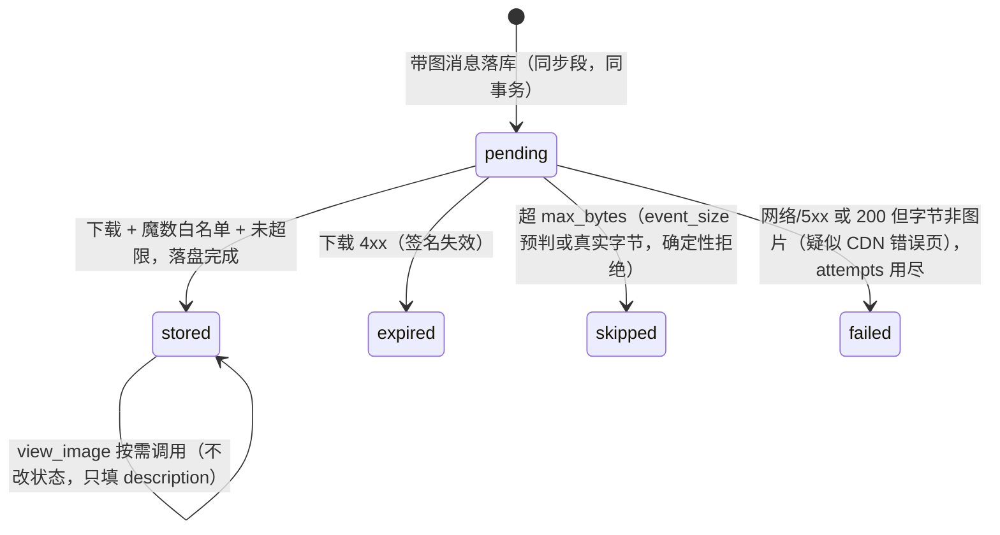
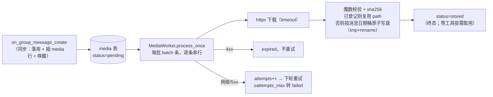

# MEDIA.md — 图片的存储与按需查看（ROADMAP M2）

解决两件事：**图片 URL 会过期**（`rkey` 是限时签名链接），以及**图片内容进不了语义层**（正文里只有 `[图片 6A30….jpg]` 这种零信息占位）。

方案 = **落盘保证"随时能看"，工具保证"需要才看"**：

- 消息落库后，后台把图片字节尽快抓到本地（按日期分桶）——这是对 URL 时效的保险；
- **不做任何预生成描述**。agent 在总结/追问过程中认为某张图值得看时，调 `view_image` 工具，工具内部发起**一次性**视觉调用、返回文字；
- 通用描述**缓存回写**，同一张图第二次被看不再花钱。

## 核心决定

| # | 决定 | 理由 |
|:---|:---|:---|
| D1 | **下载落盘，按日期分桶**：图片存 `data/media/YYYY-MM-DD/<sha256>.<ext>`。日期取**消息的发送日期**（跨天重试也落回原日期桶）；去重全局：`sha256` 已登记即复用旧 `path`（跨天转发不复制文件），桶由首次入库日期决定 | 落盘后，"还能不能看这张图"与 `rkey` 寿命无关——后台队列正常分钟级排空，远快于已实测的 17 分钟有效期。日期分桶让目录与讨论时间轴一致，翻某一天的素材直接看那一天 |
| D2 | **看图封装为工具 `view_image`，agent 按需调用**；工具内部一次性视觉调用（不进主循环、不进 checkpointer），返回文字 | 逐图预转写是"每图都花钱，不管有没有人用"；把图塞进 agent 循环则是"每轮重复计费 + base64 驻留历史"。按需工具化两头都省：安静的讨论零次调用，模型还能带着**具体问题**（`focus`）看图，比通用转写更有上下文 |
| D3 | **硬约束**：图只能进 user message（官方 vision 文档；system/assistant/tool 角色直接 400） | 所以"tool 返回图片给模型看"不存在。`view_image` 的正确形态必然是"内部看图、返回文字"——这不是妥协，是 D2 成立的机制本身 |
| D4 | 工具产出的**通用描述缓存回写**：`media.description` + 消息 `content` 的占位替换 | 第二次任何人取数/检索，这张图已经是文本（零调用）。带 `focus` 的定向回答**不**回写（它只服务于那次提问） |
| D5 | 后台 `MediaWorker` **只落盘、零 LLM**（`pending → stored` 终态） | 事件回调连 embedding 都不许调，何况网络下载；Worker 形态仍对齐 `SummaryIndexer`（wake + 轮询 + 退避），但不再有视觉那半 |
| D6 | `media` 表一行 = **一次附件出现**（uuid 主键 + 哈希列文件去重）；消息正文的占位里**嵌 8 位短 id** | 同图多人转发共享文件但各有处理状态；短 id 让模型能在取数里引用：`[图片 6A30….jpg #a1b2c3d4]` → `view_image("a1b2c3d4")`。主键不用内容哈希——与 `summary_id` 同款教训 |
| D7 | 格式白名单**按文件魔数判定**（jpeg/png/gif/webp），不看文件名与 MIME | 官方明示按真实内容判定；QQ 的 `filename` 是十六进制串、`content_type` 有裸词与 MIME 两种形态（§1.7 已核实）。白名单外（HEIC 等）标 `skipped`，占位改注 `[图片 格式不支持]` |

## 数据模型

**在 [`DATA_MODEL.md` §2.7](DATA_MODEL.md)**：`media` 表的列定义、索引、写入路径（与消息同事务、重复事件去重免费）、`placeholder` 回写锚点、日期分桶的 `path`、以及"一条消息三跳找到自己的图"的示例行。本文只讲方案与管线，不重复表结构；下面的状态机描述的就是该表 `status` 列的迁移。

## 状态机（后台 Worker 只管落盘；描述是工具侧的缓存）



## 后台管线：MediaWorker（只落盘）

形态对齐 `SummaryIndexer`（`src/rag/indexer.py`）：`wake()` + 周期轮询 + 失败退避，**零 LLM 调用**。



- 逐条串行即可——瓶颈是下载，不涉及模型，单条秒级。
- **磁盘增长**：原图不重压缩（保真、免二次编码坏图），5 个活跃群 × 日均 20 图 × 200KB ≈ 20MB/天量级。本期不做 TTL；`data/` 已 gitignore，`data/media/` 与 `qqbot.db` 同级。
- `expired` 行是"机器人离线太久"的兜底信号：占位改注 `[图片 已过期]`，取数可见，模型不会去调一个必然失败的工具。

## 工具：`view_image`（进 GROUP_TOOLS **和** C2C_TOOLS）

```python
@tool
async def view_image(
    media_ref: str,                 # 取数正文里的短 id（如 "a1b2c3d4"），支持前缀 ≥6 位
    focus: str = "",                # 可选：具体要看什么（"图里的部署流程是什么"）
    *,
    runtime: ToolRuntime[BotContext, dict],
) -> str:
    """查看一张已存图的内容。media_ref 来自消息正文 [图片 … #短id]。
    不带 focus 返回通用描述（首次看图会缓存，之后免费）；带 focus 针对性回答。"""
```

执行顺序与护栏：

1. **解析短 id** → `media` 行；查不到返回"无此图，请用最近消息里的 #短id"。
2. **群校验**：`scope=SCOPE_GROUP` 时 `row.group_openid` 必须等于注入的 `runtime.context.group_openid`——短 id 只有 8 hex，猜中别的群的 id 是可能的，显式拒绝。私聊 scope 不校验（本就跨群）。
3. **缓存优先**：无 `focus` 且 `description` 已存在 → 直接返回缓存（零调用）。这是 D4 的回报名额。
4. 读 `data/<path>` → 魔数定 MIME → base64 组 content block（`{"type":"image_url","image_url":{"url":"data:<mime>;base64,…"}}`）放 **user message**（D3）→ 对 `[llm]` 发**一次性**调用（不进 agent、不进 checkpointer）。prompt = 通用描述 或 focus 问题 + "先说主体，再逐字转写图中文字"。
5. 无 `focus` 时**同事务**回写：`media.description` + 该消息 `content` 的占位替换（锚点用写库时存的 `placeholder`；若 `description` 已回写过而占位仍是旧锚点，以 `path` 非空且占位含 `#短id` 判断幂等）。带 `focus` 的回答直接返回、不落缓存。
6. 失败（视觉调用出错）→ 返回"这张图暂时看不了：<原因>"的**错误文本**，agent 继续无图总结——一次工具失败不许拖垮整轮（同 `messages_in_range` 非法时间的返回约定）。
7. 限流：每群每次运行最多 `max_views`（默认 6）张——防模型逐图上瘾把 270 秒被动回复窗口吃光；超限返回"本群本次查看图片已达上限，请基于已有信息总结"。计数挂在 `BotContext` 上（每次运行新建，天然重置）。

**时延账**：单张看图 = 一次 vision 调用（本地文件读取，无网络下载），`detail=low` 下 2–5 秒；模型通常只在真正相关时调 1–2 张，对 5 分钟窗口无感。

**与自动总结/语料的关系**：图内容进入语料有两条路——模型把看到的写进总结正文（随总结入库、可检索），或通用描述回写进消息 `content`（随后续取数进入任何总结）。没人调用过的图保持占位形态 = "只有总结过的话题可检索"的既有限制，不是新缺口。`view_image` **不算取数工具**（不登记进 `DATA_TOOLS`）：它不读消息，不该影响 coverage 记账与 `storable()` 判定。

## 配置

```toml
[media]
enabled             = true
dir                 = "data/media"   # 根目录；内部按消息发送日期自动分桶 data/media/YYYY-MM-DD/
batch               = 10
max_bytes           = 33554432       # 32 MiB；落盘护栏（event_size 预判 + 真实字节复核）
max_inline_bytes    = 4194304        # 4 MiB；view_image 内联 base64 护栏——两条线用途不同
attempts_max        = 3
download_timeout_s  = 30
interval_s          = 15
backoff_s           = 60
max_views           = 6              # 每群每次 agent 运行的 view_image 上限
detail              = "low"          # 看图调用一律缩到 512×512，摘要场景足够且省 token
```

`pydantic` 新增 `MediaConfig` 挂进 `AppConfig`。`enabled=false` 时 MediaWorker 不启动、media 行仍入库（以后打开即补跑）；`view_image` 工具对未落盘的图返回占位说明即可，无需按开关摘除。

## CLI 面

- `qqbot stats` 增加 media 列：`pending / stored / expired / 带描述缓存 / 磁盘文件数`。
- `qqbot media [--status pending] [--limit 20]`：只读排查列表（哪条消息、卡在哪一步、last_error）。
- 不设删除命令——删文件=删语料，真要清理走文件系统手工操作，故意不设便捷闸门。

## 隐私边界

图片文件与 `media` 表不进任何检索路径（`search_summaries` 检索的仍是总结文本）。模型对图的唯一入口是 `view_image`，群内 scope 下受注入的 `group_openid` 硬校验（步骤 2）；返回的是文字，与取数工具同等对待，天然被既有预算与隔离规则覆盖。

## 验收清单（脱机，`tests/test_media.py` — 2026-10-10 起全部落地，套件 72 项）

假件注入：`http_get`（下载器）与 `describe`（一次性视觉调用），真 SQLite + 真文件写入（tmp_path）。

1. 带图消息 `insert_messages` → media 行 pending、`content` 占位含 `#短id`；重复推送不重复插行；语音/文件附件不插行。
2. Worker 成功路径：pending → stored；`data/media/<消息发送日期>/<sha256>.<ext>` 存在（跨天重试仍落回原日期桶）。
3. 全局去重：两个消息同一张图 → 一个文件（**分属不同日期桶时同样复用旧 path**）、两行 media、各自可被查看。
4. 4xx → expired 不再被拾取；5xx → attempts 累加到上限转 failed；`enabled=false` → 只攒行不处理。
5. **200 但字节魔数不过** → 按可重试走（CDN 对过期签名常回 200+错误页，不能当场判死）；attempts 用尽转 `failed`，且 `last_error` 保留技术原因不被展示文案覆盖。`skipped` 只属于确定性拒绝。
6. 超 `max_bytes` → skipped（`event_size` 预判与真实字节复核两条路径各测一次）；`view_image` 侧超 `max_inline_bytes` 有独立的明确文案。
7. `view_image` 端到端（真 ToolNode 注入）：短 id 解析、缓存命中零调用、无 focus 时描述回写 `description`+`content`（幂等——第二次回写不重复替换）、带 focus 不落缓存。
8. 群校验：G_demo 的运行拿 G_other 的短 id → 拒绝文本；私聊 scope 同 id → 放行。
9. `describe` 抛异常 → 工具返回可读错误文本，agent 运行不中断。
10. `max_views` 限流：第 7 次调用返回上限提示，`describe` 只被调 6 次。**额度只扣在真实视觉调用**上——文件缺失、超内联上限这些没走到模型的路径不扣；ref 带空格或 `#`（从占位符直接截取的 `" #4d9f…"`）同样能解析。
11. 启动时清扫孤儿 `.{sha}.ext.tmp`（上一次进程在 write 与 rename 之间被杀留下的半文件），只清 tmp 不碰成品。
12. `view_image` 不在 `DATA_TOOLS`：仅调过 view_image 的回答 `storable()` 判定不受影响（`test_agent.py` 的工具集断言：群 8 个 / 私聊 5 个）。

真机项：第一条真实图片 pending→stored；一次 @ 总结中模型主动调 `view_image` 的全链路；隔天重放验证离线积压场景（决定 expired 是否需要人工重放命令）。

## 已知边界（M2 首版，code-review 2026-10-10 确认）

- **引用/合并转发里的图片不入队列**：`media` 行的生成只遍历顶层 `rec.attachments`；`msg_elements` 嵌套附件的标签会被 `render()` 渲进正文、但没有 `#短id`，因此不可查看。§2.7 的"一次附件出现一行"目前只对顶层成立。转发聊天记录带截图在 QQ 很常见——列为 M2.x，修法是把 id 注入 `MsgElement.render` 的锚点链路。
- **thinking 保持开启（已决定，勿"修"）**：DeepSeek 官方默认开思考，reasoning token 计入 `max_tokens`；`view_image` 的一次性调用若被推理吃光预算返回空串，工具如实报"模型对这张图没有返回内容"。2026-10-10 用户拍板**接受这个代价换推理质量**，不注入 `extra_body={"thinking":{"type":"disabled"}}`（详见 CLAUDE.md §5.1.1.2 的决定块）。若真机出现截断，处置是调大 `[llm].max_tokens`，不是关思考。

## M2.5（可选升级，本期不做）

若需要模型**反复放大同一张图的细节**（跨多轮推理看像素，而非一次性文字回答）：把图块附进当前运行的 user message，配 middleware 做"本轮保留、历史剥图"+ run 后重写 state。机制清单已在讨论中列明（每轮重复计费、checkpointer 驻留、跨运行区分三条），触发条件出现再立项；`view_image` 的缓存语义与之完全兼容，届时只加不减。
